## Kotlin+JetPack+协程实现的MVVM架构Wanandroid客户端
- 项目基于Kotlin语言，采用ViewModel+LiveData实现MVVM架构。
- 网络请求采用协程，数据库采用Room。
- 界面黑白配色，优雅美观，适合阅读。
- 适配了白天黑夜模式。
#### 已有功能
- 首页（搜索、热门、最新、广场、项目、公众号）
- 体系
- 发现（搜索、分享文章、Banner、热搜、常用网站）
- 导航
- 我的（登录、注册、我的积分、积分排行、我的分享、我的收藏、浏览历史）
- 系统设置（日夜间模式、文章字体大小、清除缓存）
#### 效果预览
<table>
<tr>
<td bgcolor=#dfe2e5></td>
<td bgcolor=#dfe2e5>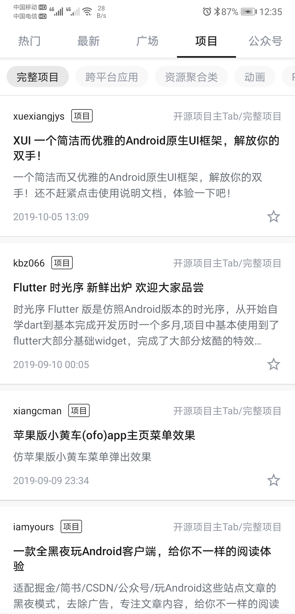</td>
<td bgcolor=#dfe2e5>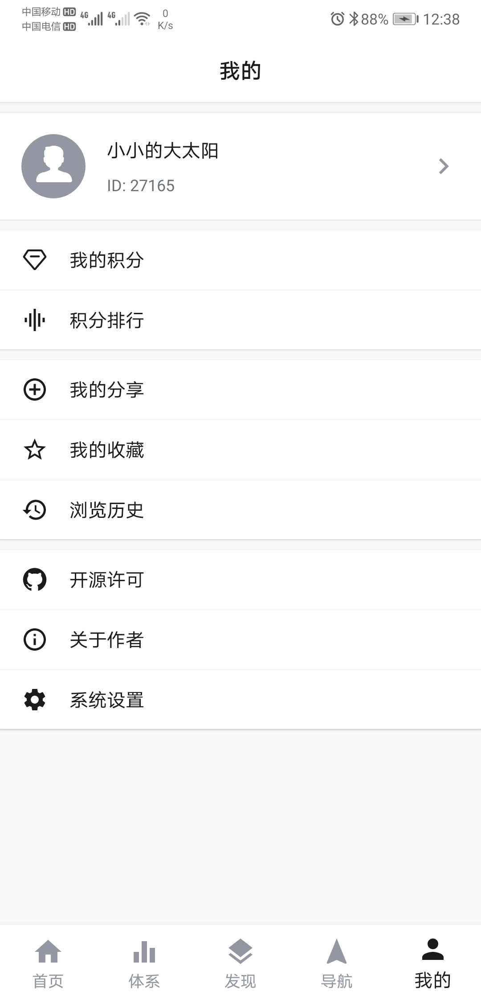</td>
</tr>
<tr>
<td bgcolor=#dfe2e5>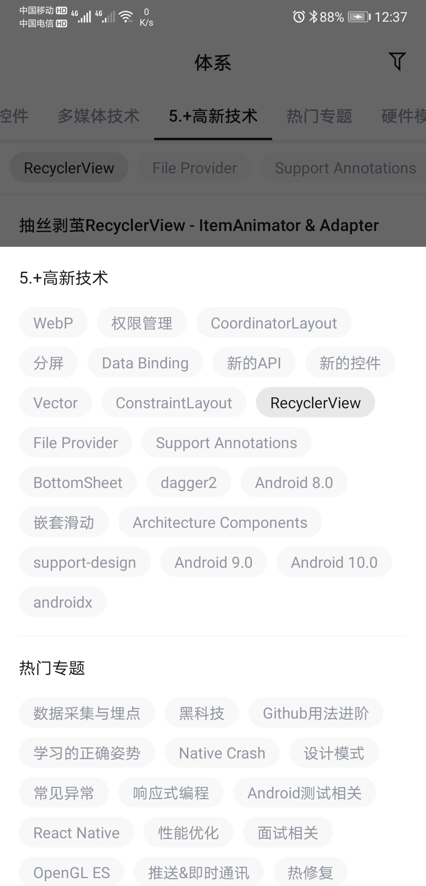</td>
<td bgcolor=#dfe2e5>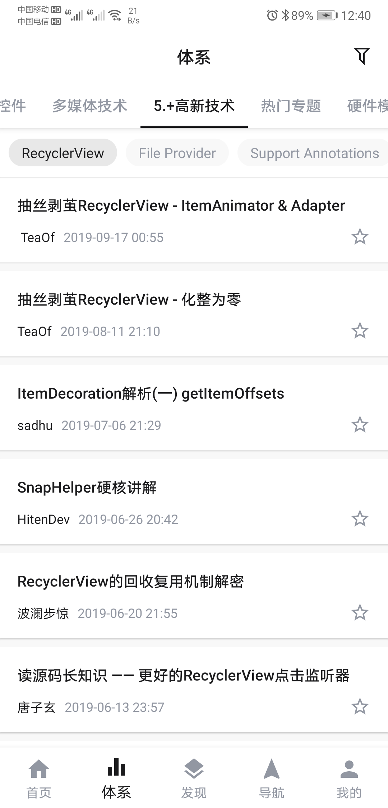</td>
<td bgcolor=#dfe2e5>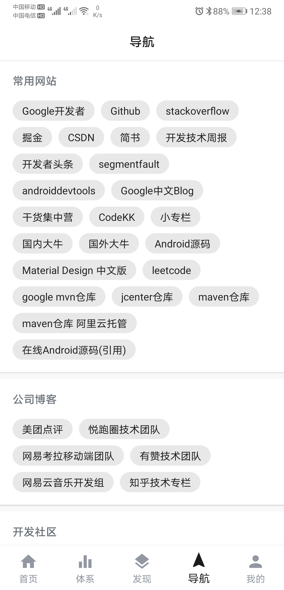</td>
</tr>
<tr>
<td bgcolor=#dfe2e5>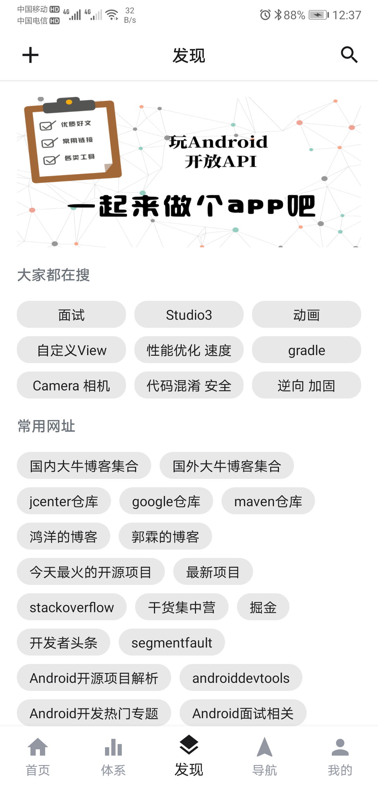</td>
<td bgcolor=#dfe2e5>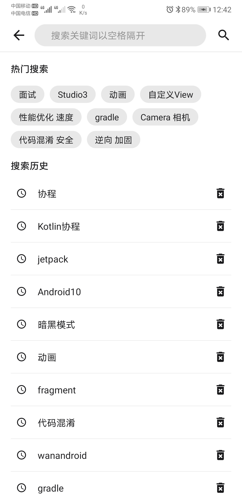</td>
<td bgcolor=#dfe2e5>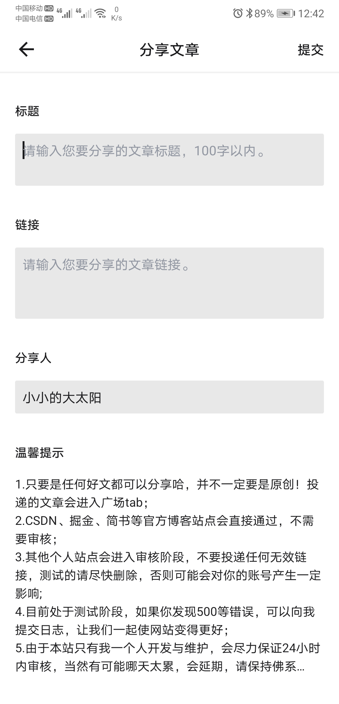</td>
</tr>
<tr>
<td bgcolor=#dfe2e5>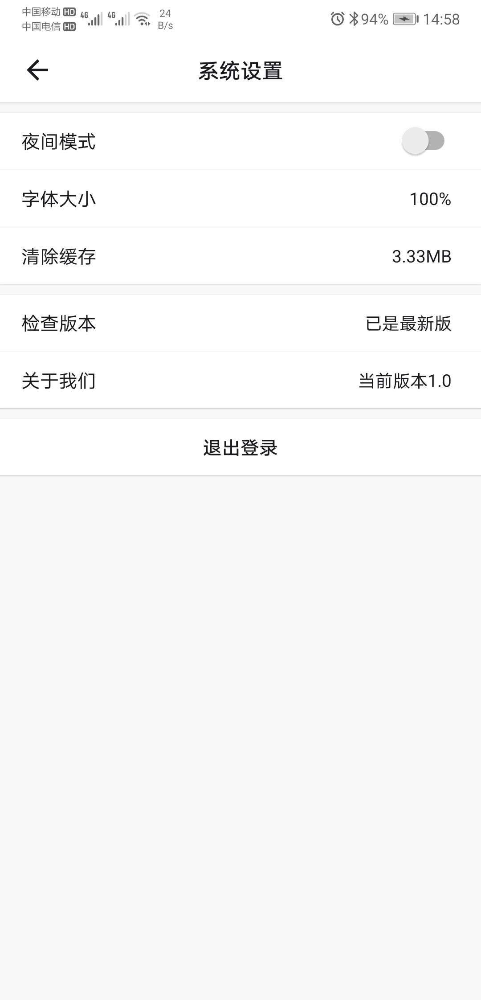</td>
<td bgcolor=#dfe2e5>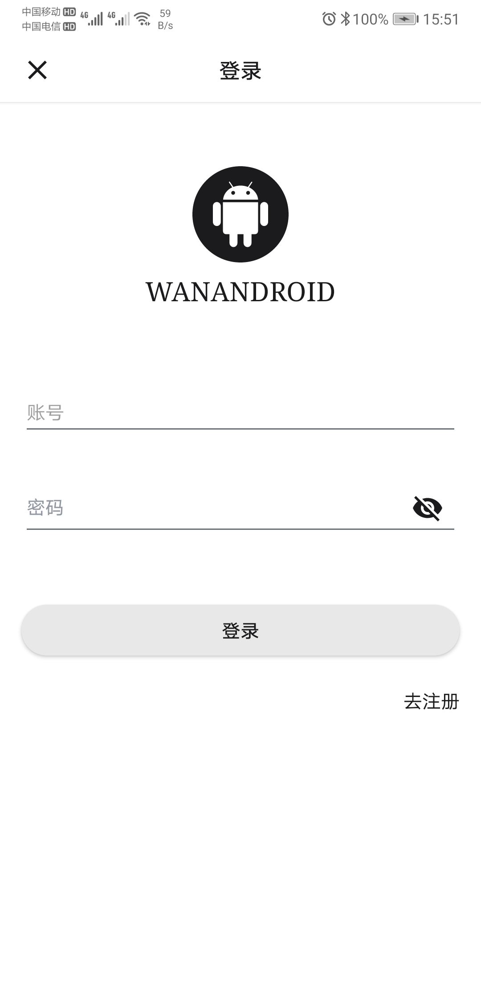</td>
<td bgcolor=#dfe2e5>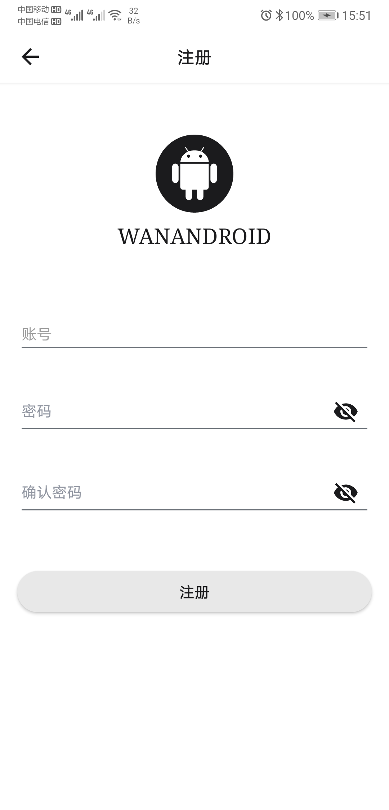</td>
</tr>
<tr>
<td bgcolor=#dfe2e5>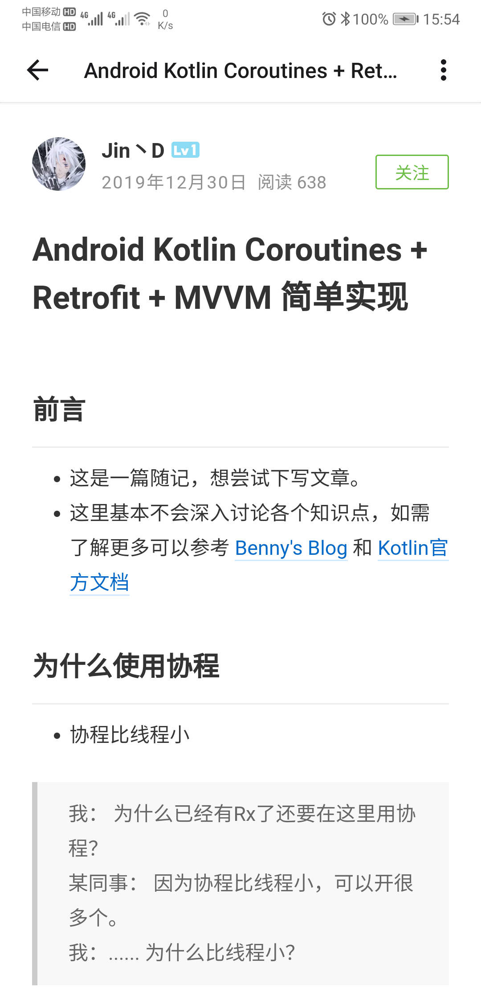</td>
<td bgcolor=#dfe2e5>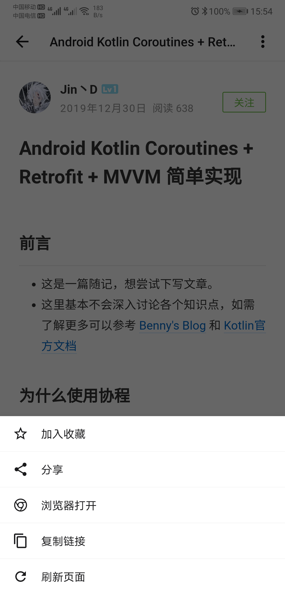</td>
<td bgcolor=#dfe2e5>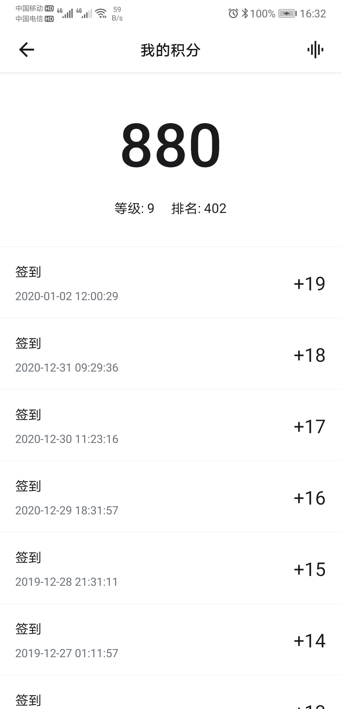</td>
</tr>
<tr>
<td bgcolor=#dfe2e5></td>
<td bgcolor=#dfe2e5>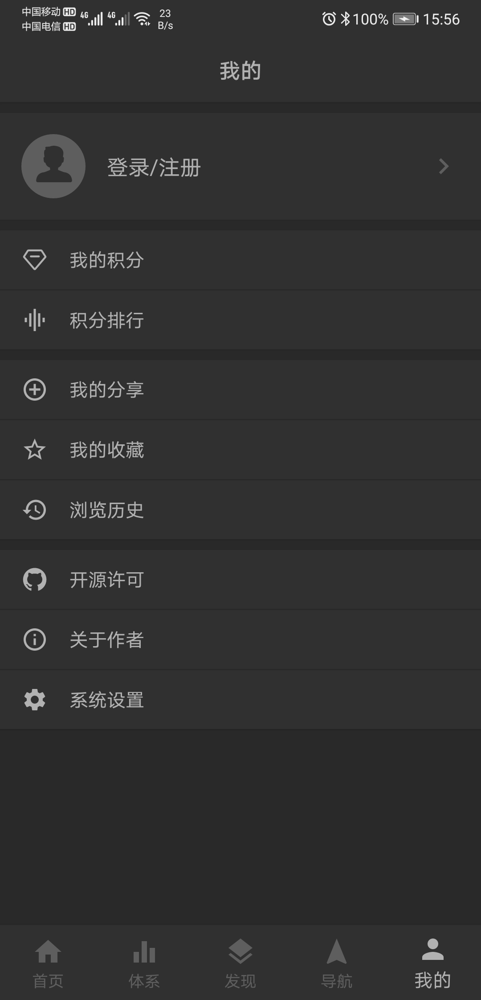</td>
<td bgcolor=#dfe2e5>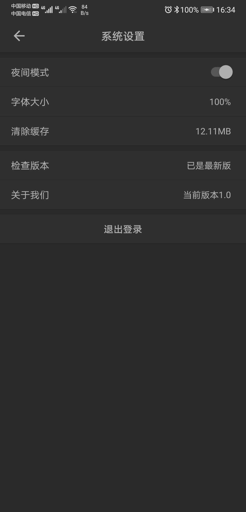</td>
</tr>
</table>

