# WanAndroid · Compose Multiplatform

基于 [WanAndroid 开放 API](https://wanandroid.com/) 的 Kotlin 客户端，支持 **Android、iOS、HarmonyOS 和 Web**。文章浏览、分类、搜索、收藏、分享、积分和设置共用一套 Compose UI 与业务代码。

项目经历了 **View/XML → Jetpack Compose → Compose Multiplatform** 两次迁移，迁移实现、构建和本地回归由 Codex 执行。当前保留原有页面风格、导航与列表交互，以及 Android 的渠道配置。

[工程目录](#工程目录) · [运行截图](docs/screenshots/README.md) · [快速开始](#快速开始) · [支持与验证](#支持与验证) · [迁移记录](docs/multiplatform-migration.md)

## 运行效果

以下为 2026-09-06 迁移回归时在三个模拟器上采集的实际运行画面，应用版本为 `1.0.6`。完整图库按相同页面并排展示，覆盖首页各 Tab、体系、发现、导航、搜索、文章、个人页面及夜间模式。

<table>
<tr><th>Android</th><th>iOS</th><th>HarmonyOS</th></tr>
<tr>
<td>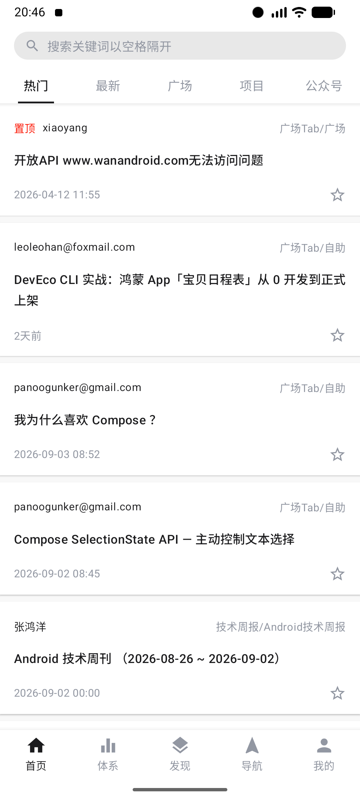</td>
<td>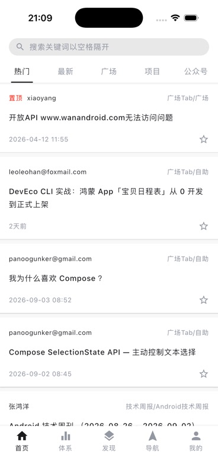</td>
<td>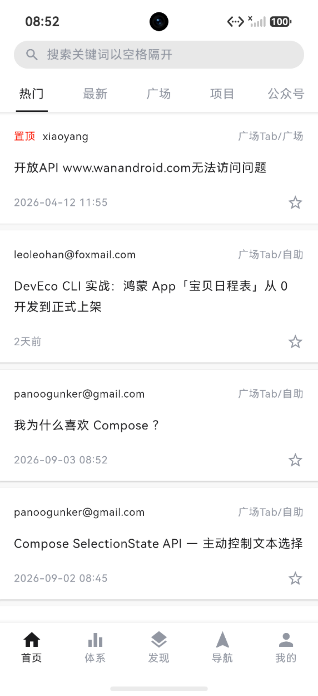</td>
</tr>
<tr>
<td>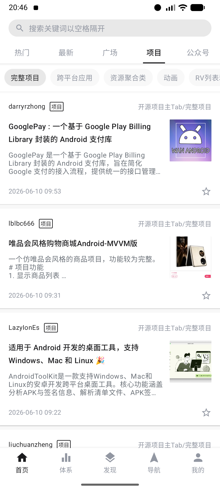</td>
<td>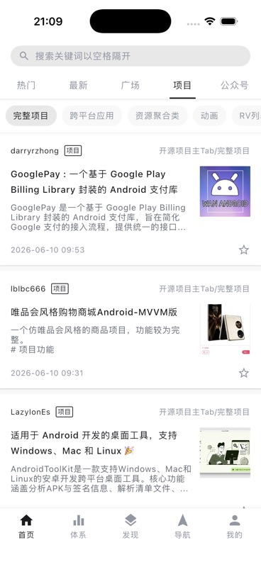</td>
<td>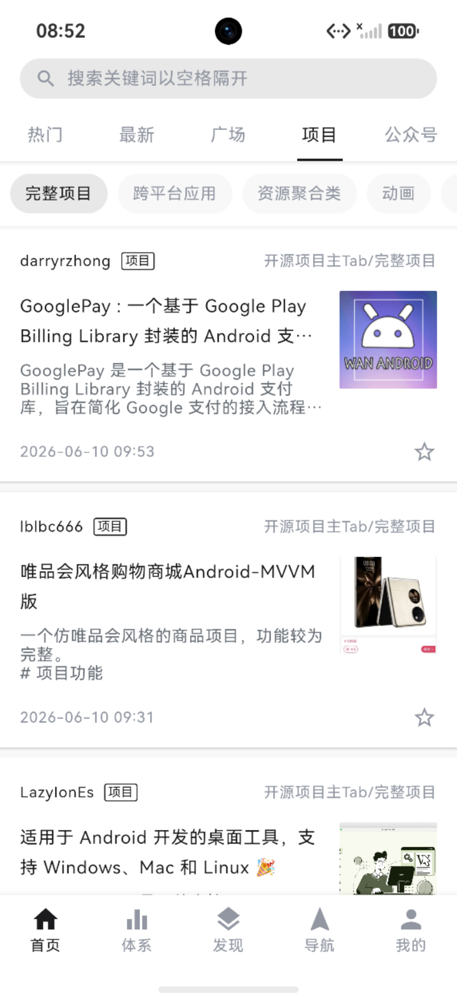</td>
</tr>
<tr>
<td>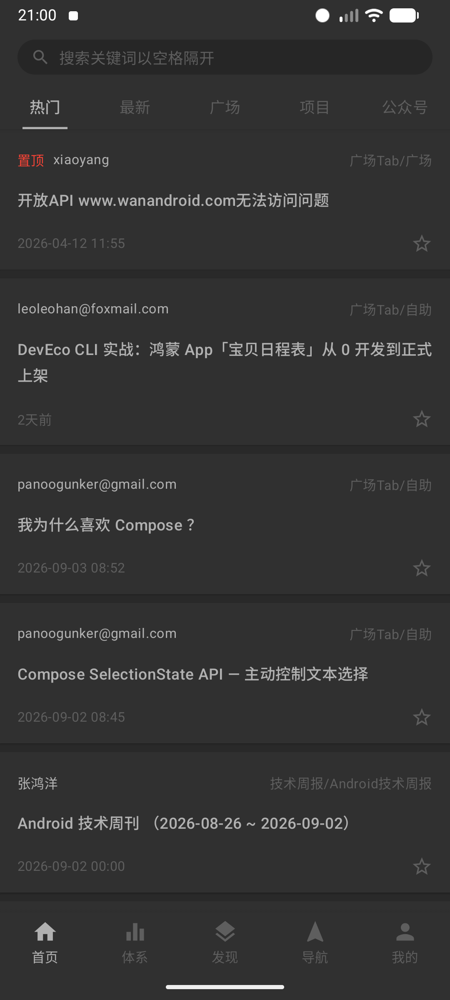</td>
<td>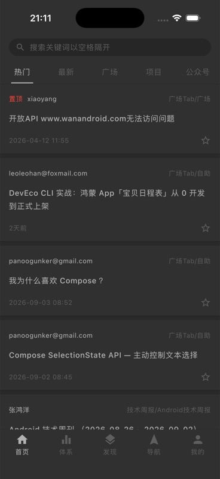</td>
<td>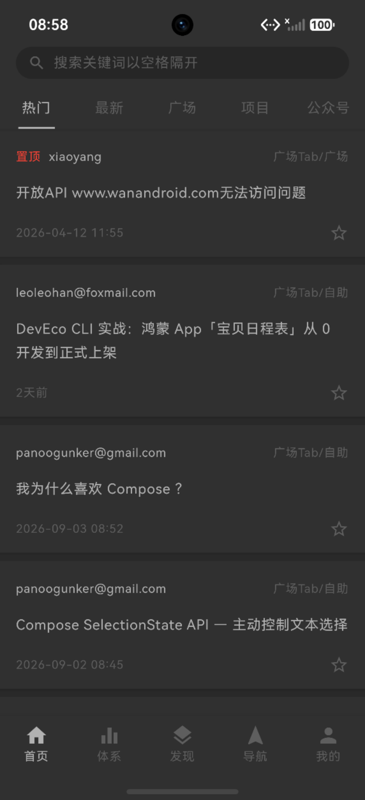</td>
</tr>
</table>

**[查看三端完整截图与采集说明 →](docs/screenshots/README.md)**

<details>
<summary>Web 运行画面</summary>

Web 使用相同的 Compose 页面，通过 Wasm 运行；API 和图片请求由同源服务代理。

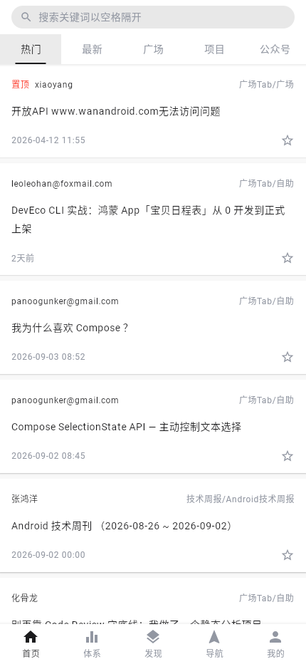
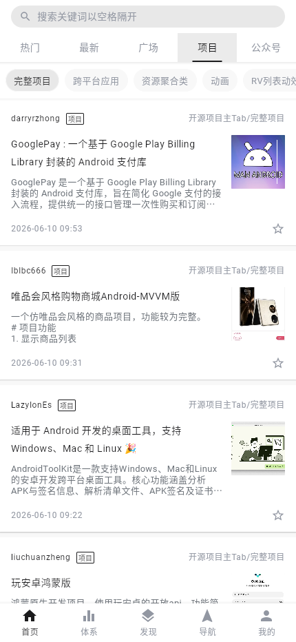

</details>

## 功能

| 模块 | 功能 |
| --- | --- |
| 首页 | 热门、最新、广场、项目、公众号；分类切换、刷新、分页、回顶 |
| 体系 | 一级/二级分类、分类选择、分类文章列表 |
| 发现与导航 | Banner、热搜、常用网站、分类站点、文章跳转 |
| 搜索与阅读 | 关键词搜索、搜索历史、结果分页、内嵌网页、阅读历史及长按删除 |
| 账号与个人 | 登录、注册、积分、排行、我的收藏、我的分享、分享提交与删除 |
| 设置 | 日夜间模式、文章字体大小、缓存清理、版本信息、关于和开源列表 |

## 快速开始

### 环境

| 平台 | 所需环境 |
| --- | --- |
| 公共构建 | JDK 17；使用仓库提供的 Gradle Wrapper |
| Android | Android SDK 37、模拟器或设备；在本机 `local.properties` 中设置 SDK 路径 |
| iOS | Apple Silicon Mac、Xcode、iOS Simulator；当前提供 `iosArm64` 和 `iosSimulatorArm64` |
| HarmonyOS | DevEco Studio 26.0.0、配套 HarmonyOS SDK、ohpm、hvigor；配置 `OHOS_SDK_HOME` 与 `DEVECO_SDK_HOME` |
| Web | Node.js 22+、支持 Wasm GC 的浏览器 |

以下命令从仓库根目录执行。首次构建需要下载依赖；各平台 SDK 和签名属于本机配置。

### Android Studio 运行入口

同步工程后，可在顶部运行配置中选择对应应用：

| 入口 | 行为 |
| --- | --- |
| `androidApp` | 构建并运行 Android 应用；使用 Android Studio 的设备选择器 |
| `iosApp` | 通过 Kotlin Multiplatform 插件与 Xcode 工程运行 iOS；也可直接使用 Xcode |
| `webApp` | 构建 Wasm 应用并启动静态页面、API 与图片代理服务；点击控制台中的本地网址访问 |
| `harmonyApp` | 安装 OHPM 依赖、编译共享库、构建 HAP，然后通过 hdc 安装并启动鸿蒙应用 |

Web、鸿蒙入口保存于 [.run](.run/)，使用 IDE 自带的 Shell Script 配置。当前默认 `/bin/zsh -l`，会加载 macOS 的 `~/.zprofile`，因此 SDK 环境变量与工具的 `PATH` 应在该文件配置；其他开发环境可在 **Run → Edit Configurations** 调整解释器。若入口未出现，确认 **Shell Script** 插件已启用，并重新打开运行配置列表。保存方式见 [JetBrains 运行配置说明](https://www.jetbrains.com/help/idea/run-debug-configuration.html)。

`webApp` 的服务在 Run 窗口持续运行，点击 Stop 即可停止；共享代码改动后重新运行会重新构建。默认端口为 8080，可在运行配置的环境变量中设置 `PORT`。

运行 `harmonyApp` 前先启动鸿蒙模拟器，或连接并授权真机 USB 调试。仅连接一个设备时自动选择；连接多个设备时，Run 控制台会列出设备编号、ID 和名称，点击控制台并输入编号后回车，输入 `q` 取消。也可在 **Run → Edit Configurations → harmonyApp → Environment variables** 中设置 `HDC_DEVICE_ID` 固定设备，值取自 `hdc list targets -v` 中处于 `Connected` 状态的设备。

`harmonyApp` 是 Shell Script 入口，不能使用 Android Studio 的 Android 设备下拉框。若需要原生鸿蒙设备选择器或 ArkTS/C++ 断点调试，用 DevEco Studio 打开 `harmonyApp` 并运行 `entry`。

### Android

```bash
./gradlew help
./gradlew :androidApp:assembleEnterpriseAlphaDebug
adb install -r androidApp/build/outputs/apk/enterpriseAlpha/debug/wandroid_enterprise_alpha_v1.0.6_20260514.apk
adb shell am start -n com.xiaojianjun.wanandroid/.ui.compose.MainComposeActivity
```

也可使用 Android Studio 运行 `androidApp`。原有渠道与环境 flavor 保留；当前版本不提供旧版持久化数据迁移。

从旧目录结构更新后，先执行 **Sync Project with Gradle Files**，再在顶部运行配置中选择 `androidApp`，并在 **Build Variants** 中选择 `enterpriseAlphaDebug`。若仍报 `project 'app' not found`，说明 IDE 沿用了旧运行配置：在 **Run → Edit Configurations** 中将 Android 配置的 Module 改为同步后的 `wanandroid.androidApp`，或使用新生成的 `androidApp` 配置。

### iOS

```bash
open iosApp/iosApp.xcodeproj
```

选择 `iosApp` scheme 和 iOS 模拟器运行。Xcode 构建阶段会自动生成、链接共享 framework 并同步 Compose 资源。模拟器无需开发团队签名；真机/归档需配置 `iosApp/Configuration/Config.xcconfig` 和有效签名。

### HarmonyOS

```bash
./harmonyApp/run.sh
```

脚本会生成共享库、构建 HAP，并安装到所选设备。优先安装本次生成的 `entry-default-signed.hap`；未配置签名时生成的 `unsigned.hap` 仅适用于允许未签名安装的模拟器。安装失败会立即停止；安装、启动失败均返回非零退出码。

真机首次运行需要按照[华为官方自动签名流程](https://developer.huawei.com/consumer/cn/doc/harmonyos-guides/ide-signing-auto)完成配置：

1. 连接真机并授权 USB 调试，用 DevEco Studio 打开 `harmonyApp`。
2. 进入 **File → Project Structure → Project → Signing Configs**，勾选 **Automatically generate signature**，按提示登录华为开发者账号并完成签名。
3. 确认 `build-profile.json5` 中 `app.products` 的 `default` 产品绑定 `signingConfig: "default"`，名称与 `app.signingConfigs` 中生成的签名方案一致。
4. 解锁真机并保持亮屏，再运行 `harmonyApp`。新增调试设备后，需重新自动签名以更新 Profile 中的设备列表。

签名材料和 `build-profile.json5` 中生成的本机签名字段保留在本地，不提交个人证书、密码和绝对路径。发布包需要另外配置发布证书。工程显式设置 `targetSdkVersion` 为 `26.0.0`，与当前配套 SDK 及此前产物的实际目标版本一致。

也可先执行 `./harmonyApp/harmony/gradlew -p harmonyApp/harmony publishDebugBinariesToHarmonyApp`，再在 DevEco Studio 运行 `entry`；修改共享源码后需重新生成共享库。启动脚本的设备选择、签名产物选择和错误处理可运行 `node --test harmonyApp/run.test.mjs` 验证。

### Web

```bash
./webApp/web/run.sh
```

脚本先执行 `:webApp:wasmJsBrowserDistribution`，再启动 `webApp/web/server.mjs`。访问 [http://127.0.0.1:8080](http://127.0.0.1:8080)；服务默认读取 `webApp/build/dist/wasmJs/productionExecutable`，支持通过 `PORT`、`WANANDROID_WEB_DIST` 修改端口和产物目录。

API 代理负责跨域和 HttpOnly Cookie，不能直接以 `file://` 打开页面。公网部署需配置 HTTPS 反向代理；完整命令与配置说明见[构建文档](docs/multiplatform-migration.md#构建与运行)。

## 架构与技术栈

工程参考 JetBrains 的[模块结构指导](https://kotlinlang.org/docs/multiplatform/multiplatform-project-recommended-structure.html)组织：`shared` 提供共享 UI 和业务，各平台宿主负责启动与打包。Android、iOS、Web 使用根 Gradle 构建；HarmonyOS 使用独立的 CPF Gradle 构建编译同一份共享源码，再由 Hvigor 打包。

页面按功能组织，采用 ViewModel、StateFlow、Repository 的数据流。`model/repository` 负责数据访问，`di/AppContainer` 组装依赖并通过构造参数交给 ViewModel；导航条目负责 ViewModel 生命周期。Ktor 与 kotlinx.serialization 负责 API，Coil 3 负责图片，`expect/actual` 提供平台能力。

### 工程目录

主要源码、宿主与构建入口如下：

```text
wanandroid/
├── shared/                        共享 UI、业务和平台适配源码
│   ├── build.gradle.kts           Android Library、iOS framework、Wasm 库目标
│   └── src/
│       ├── commonMain/            Kotlin 业务、Compose 页面及 composeResources
│       ├── commonTest/            共享状态、API、存储与依赖注入测试
│       ├── androidMain/           SharedPreferences、OkHttp、WebView、系统栏
│       ├── iosMain/               iOS 控制器入口、NSUserDefaults、Darwin、WKWebView
│       ├── ohosMain/              鸿蒙控制器入口、文件存储、NetworkKit 桥接
│       └── wasmJsMain/            浏览器存储、返回事件、iframe 平台适配
├── androidApp/
│   ├── build.gradle.kts           APK、渠道、环境、签名与 Room 配置
│   └── src/                       Application、Activity、Room 阅读历史及宿主测试
├── iosApp/
│   ├── Configuration/             Xcode 版本、包名和签名配置
│   ├── iosApp/                    SwiftUI 宿主、Info.plist、应用图标
│   └── iosApp.xcodeproj/          Xcode 工程及共享 framework 构建阶段
├── webApp/
│   ├── build.gradle.kts           Wasm 可执行目标与 Webpack 配置
│   ├── src/wasmJsMain/            浏览器 main 入口、HTML、字体和许可证
│   └── web/
│       ├── run.sh                 构建 Web 并启动本地服务
│       ├── server.mjs             静态产物托管、同源 API 与图片代理
│       └── server.test.mjs        代理服务测试
├── harmonyApp/
│   ├── AppScope/                  鸿蒙应用信息、图标和全局资源
│   ├── entry/                     ArkUI 宿主、N-API、NetworkKit、ArkWeb 与 HAP 模块
│   ├── harmony/                   独立 CPF Gradle 工程、Wrapper 及原生库发布任务
│   ├── hvigor/                    Hvigor 配置
│   ├── hvigorfile.ts              鸿蒙应用构建入口
│   ├── build-profile.json5        产品、SDK 与签名方案
│   ├── oh-package.json5           OHPM 依赖
│   ├── run.sh                     选择设备、构建、安装并启动鸿蒙应用
│   └── run.test.mjs               设备选择与部署错误处理测试
├── .run/                          Web、HarmonyOS 共享 IDE 运行配置
├── gradle/
│   ├── libs.versions.toml         Android、iOS、Web 的依赖与插件版本
│   └── wrapper/                   根 Gradle Wrapper 配置
├── build.gradle.kts               根构建插件声明
├── settings.gradle.kts            根 Gradle 模块注册与仓库配置
├── gradle.properties              根构建参数
├── gradlew                        根 Gradle 启动脚本（Windows 使用 gradlew.bat）
├── docs/                          迁移记录、运行截图和验证记录
├── images/                        原 View/XML 版本的历史图片
└── README.md
```

根 [settings.gradle.kts](settings.gradle.kts) 只注册 `:shared`、`:androidApp`、`:webApp` 三个 Gradle 模块。Android Studio 打开仓库根目录，Xcode 打开 `iosApp/iosApp.xcodeproj`，DevEco Studio 打开 `harmonyApp`。

`androidApp` 和 `webApp` 通过 Gradle 依赖 `shared`，`iosApp` 链接它导出的 framework。`shared` 的 Wasm 目标只生成库，浏览器入口和可执行产物由 `webApp` 提供；`webApp/web` 负责静态产物托管和同源代理服务，独立运行。

`harmonyApp/harmony` 显式引用 `shared/src/commonMain` 的 Kotlin 源码和 Compose 资源，以及 `shared/src/ohosMain`，将原生库、头文件和资源发布到 `harmonyApp/entry`。`ohosMain` 由这个独立工程编译，根 Gradle 的 `shared` 未注册 OHOS 目标。`harmonyApp/harmony` 与 `webApp/web` 按所属平台归档是本项目的组织约定，并非官方强制目录。

### 当前版本配置

| 组件 | Android / iOS / Web | HarmonyOS |
| --- | --- | --- |
| Gradle | 9.7.1 | 8.14.3 |
| Kotlin | 2.4.10 | 2.2.21-1.0.0 |
| Compose Multiplatform | 1.12.0 | 1.9.2-1.0.0 |

Android 使用 AGP **9.4.0**，`compileSdk` / `targetSdk` 为 **37**，`minSdk` 为 **23**。版本来源为根 [Gradle Wrapper](gradle/wrapper/gradle-wrapper.properties)、[版本目录](gradle/libs.versions.toml)、[鸿蒙 Gradle 构建](harmonyApp/harmony/build.gradle.kts)及其 [Wrapper](harmonyApp/harmony/gradle/wrapper/gradle-wrapper.properties)。完整依赖对照见[依赖组合](docs/multiplatform-migration.md#依赖组合)。

### 构建配置与工具链

四端都有各自的工具链。仓库保存版本声明、构建脚本和工程配置，JDK、SDK、编译器等由开发机安装或构建工具下载。

| 平台 | 仓库中的配置与构建流程 | 本机工具 |
| --- | --- | --- |
| Android | 根 Gradle 构建 `shared` 与 `androidApp`，生成 APK；配置位于各模块的 `build.gradle.kts` | JDK、Android SDK |
| iOS | `iosApp` 的 Xcode 构建阶段调用根 Gradle 的 `:shared:embedAndSignAppleFrameworkForXcode`，再由 Xcode 编译 SwiftUI 宿主并链接 framework | JDK、Kotlin/Native、Xcode 自带的 Swift 编译器和 iOS SDK |
| Web | 根 Gradle 将 `shared` 与 `webApp` 编译为 Wasm 应用；`webApp/web/server.mjs` 通过 Node.js 托管产物并提供同源代理 | JDK、构建插件管理的 Node.js 等依赖；运行代理服务另需本机 Node.js |
| HarmonyOS | `harmonyApp/harmony` 的独立 Gradle 编译共享源码，再由 `harmonyApp` 中的 Hvigor/ArkTS 工程生成 HAP | JDK、CPF Kotlin/Native、DevEco Studio、HarmonyOS SDK、ohpm、Hvigor |

Android、iOS、Web 的 Kotlin/Compose 构建使用同一套版本，由根目录的 [Gradle Wrapper](gradle/wrapper/gradle-wrapper.properties) 和 [版本目录](gradle/libs.versions.toml)管理，因此无需额外建立独立 Gradle 工程。iOS 的原生宿主仍有独立的 [Xcode 工程](iosApp/iosApp.xcodeproj/project.pbxproj)。

HarmonyOS 使用 CPF-KMP-CMP 的 OHOS 适配发行版，因此本项目在 [harmonyApp/harmony](harmonyApp/harmony/) 中隔离版本与构建配置。编译器本体位于本机工具或缓存目录；[webApp/web](webApp/web/) 保存 Node.js 运行服务，Web 编译仍由根 Gradle 完成。

默认安装与缓存位置如下，实际路径以本机配置为准：

- **Gradle 与插件**：Wrapper 下载到 `~/.gradle/wrapper/dists`，插件和依赖缓存在 `~/.gradle/caches`；可通过 `GRADLE_USER_HOME` 更改根目录。
- **Kotlin/Native**：编译器及原生依赖通常位于 `~/.konan`，iOS 与 HarmonyOS 使用各自版本的发行包。
- **JDK 与 Android SDK**：由 IDE 或开发者安装；JDK 通过 `JAVA_HOME` 或 IDE 的 Gradle JDK 设置选择，Android SDK 通过本机 `local.properties` 的 `sdk.dir` 指定。
- **Xcode 工具链**：随 Xcode 安装；使用 `xcode-select -p` 查看当前开发者目录，Swift 编译器与 iOS SDK 位于该目录下。
- **HarmonyOS 工具链**：由 DevEco Studio/SDK 管理器安装；本项目构建使用 `OHOS_SDK_HOME`、`DEVECO_SDK_HOME` 和本机命令路径定位相关工具。

## 支持与验证

以下记录来自 **2026-09-06 至 2026-09-07** 的迁移与架构回归：Android APK、iOS 模拟器应用、HarmonyOS 原生库/HAP 和 Web Wasm 产物均完成构建与运行验证。当时主工程使用 Gradle 9.4.1、Kotlin 2.3.20、Compose 1.10.3；当前配置见[当前版本配置](#当前版本配置)，依赖升级后的全量四端回归结果尚未补录。

公开页面使用真实 API；账号及服务端写操作目前仅完成浏览器隔离模拟接口回归，四端真实账号闭环尚待专用测试账号验证。

| 能力 | Android | iOS | HarmonyOS | Web |
| --- | --- | --- | --- | --- |
| 主页面、搜索、详情、历史、主题 | 已实测 | 已实测 | 已实测 | 已实测 |
| 文章字号 | 文字缩放 | 整页缩放 | 文字缩放 | 整页缩放 |
| 图片缓存清理 | 支持 | 支持 | 支持 | 支持应用可控缓存 |
| GIF 动画 / 视频帧解码 | 已接入 | 未接入 | 未接入 | 未接入 |
| 禁止 iframe 的文章 | 原生网页容器 | 原生网页容器 | 原生网页容器 | 外部打开 |

各端缓存统计与清理范围不同，列表仍采用平台默认的 overscroll 手感；Web 弹窗关闭后还存在上游无障碍树恢复问题。完整差异、实测设备和未验证范围见[验证记录](docs/multiplatform-migration.md#验证结果)。

回归命令：

```bash
./gradlew :shared:testAndroidHostTest :androidApp:testEnterpriseAlphaDebugUnitTest
node --test webApp/web/server.test.mjs
node --test harmonyApp/run.test.mjs
```

迁移及运行入口修复阶段已记录 **35 项共享测试、1 项 Android 宿主测试、6 项 Web 代理测试、16 项鸿蒙启动脚本测试**通过。鸿蒙签名 HAP 已安装到 Mate 60，启动验证受手机锁屏限制；具体结果见迁移文档中的[运行入口修复验证](docs/multiplatform-migration.md#运行入口修复验证2026-09-07)。

## 迁移与维护

- [迁移架构、平台适配与复审记录](docs/multiplatform-migration.md)
- [三端截图、采集环境与页面范围](docs/screenshots/README.md)
- [依赖升级、版本同步与发布注意事项](docs/multiplatform-migration.md#维护与发布)

原 View/XML 时期的图片保留在 `images/`，当前 README 展示迁移后的运行画面。

## 致谢

- [WanAndroid](https://wanandroid.com/)：开放 API 与内容。
- [Compose Multiplatform](https://github.com/JetBrains/compose-multiplatform)、[CPF-KMP-CMP](https://gitcode.com/CPF-KMP-CMP)：跨平台 UI 与鸿蒙适配。
- [Ktor](https://github.com/ktorio/ktor)、[Coil](https://github.com/coil-kt/coil)：网络与图片加载。
- [Noto CJK](https://github.com/notofonts/noto-cjk)、[Noto Emoji](https://github.com/googlefonts/noto-emoji)：Web 字体；对应 OFL 许可证随 [Web 资源](webApp/src/wasmJsMain/resources/licenses/) 一起提供。
