# WanAndroid Compose 客户端

这是一个基于 [WanAndroid](https://www.wanandroid.com/) 开放 API 的 Android 客户端。项目最早使用传统 View + XML 实现界面，后来已经完整迁移到 Jetpack Compose：从页面、导航、主题、列表状态到旧 XML 资源清理，**迁移过程全部由 Codex 完成，开发者没有手写一行迁移代码**。

> **View + XML 到 Jetpack Compose 的迁移过程全部由 Codex 完成，没有手写一行迁移代码。**

当前版本保留了原项目的阅读体验和功能范围，同时将 UI 层收敛到单一 Compose Activity、Navigation 3 路由和按功能拆分的 Compose 页面目录中，方便继续演进和维护。

## 项目特点

- 使用 Jetpack Compose + Material 3 构建声明式 UI。
- 使用 Navigation 3 管理首页、详情、登录、收藏、分享、积分等页面流转。
- 使用 ViewModel + Kotlin Flow 承载页面状态和一次性事件。
- 使用 Retrofit + Moshi + OkHttp 完成网络请求和 Cookie 持久化。
- 使用 Room 保存搜索历史、阅读历史等本地数据。
- 使用 Coil 加载文章、Banner 等图片资源。
- 支持日间/夜间模式、文章字体大小调整、缓存清理。
- 保留多渠道、多环境构建维度，适合继续做发布验证。

## Codex 迁移说明

本项目的一个核心看点是：旧版 View + XML 客户端已经由 Codex 迁移为 Compose 客户端。迁移覆盖了以下内容：

- 将原有 Activity、Fragment、Adapter、XML layout 页面迁移为 Compose Screen 和 Compose ViewModel。
- 将主页、体系、发现、导航、我的、搜索、详情、登录注册、分享、收藏、历史、积分等功能接入 Compose 导航。
- 将旧的 LiveData 页面状态迁移为 Flow/StateFlow 驱动的 Compose 状态。
- 将仍然有价值的 Repository 移入对应 `ui/compose/*` 功能目录。
- 删除不再使用的 View/XML 代码、Synthetic 代码、layout/menu 资源和未引用 drawable/color 资源。
- 使用 Gradle 单元测试和 Debug 构建验证迁移结果。

换句话说，这不是一个“新建 Compose Demo”，而是一次真实项目从传统 Android View 体系到 Compose 体系的端到端迁移。

## 功能范围

- 首页：热门、最新、广场、项目、公众号文章流。
- 体系：知识体系分类、二级分类文章列表。
- 发现：Banner、热搜、常用网站、搜索入口、分享文章入口。
- 导航：WanAndroid 导航分类与站点跳转。
- 我的：登录、注册、个人积分、积分排行、我的分享、我的收藏、浏览历史。
- 详情：文章 Web 内容浏览、收藏状态同步。
- 设置：日夜间模式、文章字体大小、清除缓存。

## 技术栈

- 语言：Kotlin
- UI：Jetpack Compose、Material 3
- 导航：AndroidX Navigation 3
- 架构：ViewModel、Flow、Repository
- 网络：Retrofit、OkHttp、Moshi
- 本地存储：Room
- 图片：Coil
- 构建：Gradle、Android Gradle Plugin、KSP、Version Catalog

## 目录结构

```text
app/src/main/java/com/xiaojianjun/wanandroid
├── model          # API、实体、Room、用户和设置存储
├── ui/compose     # Compose 页面、导航、主题、通用组件
├── common         # 通用能力和基础工具
└── util           # 缓存等工具类
```

`ui/compose` 是当前主要 UI 入口：

```text
ui/compose
├── home           # 首页文章流
├── system         # 体系
├── discovery      # 发现
├── navigationpage # 导航页
├── profile        # 我的
├── search         # 搜索与搜索历史
├── detail         # 文章详情
├── personal       # 我的收藏、分享、历史
├── points         # 积分与排行
├── settings       # 设置
├── navigation     # Navigation 3 路由封装
└── theme          # Compose 主题
```

## 构建验证

常用验证命令：

```bash
./gradlew testEnterpriseAlphaDebugUnitTest --no-daemon
./gradlew assembleEnterpriseAlphaDebug --no-daemon
```

Debug 包输出名称包含 flavor、版本名和版本号，便于区分渠道和环境。

## 效果预览

以下截图沿用原项目已有截图，可用于快速了解功能覆盖和页面风格。

<table>
<tr>
<td bgcolor=#dfe2e5></td>
<td bgcolor=#dfe2e5></td>
<td bgcolor=#dfe2e5>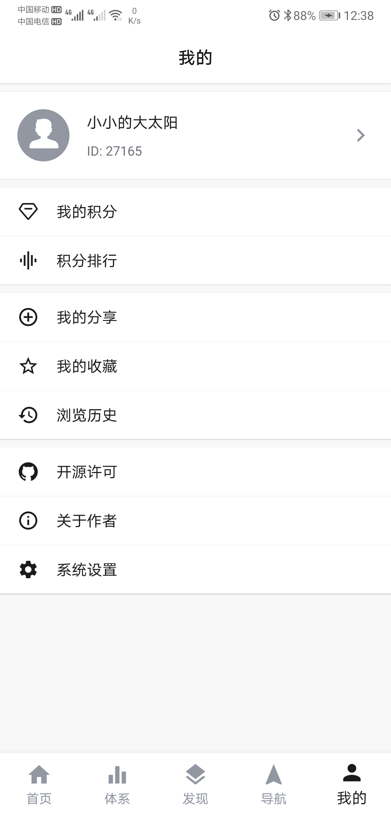</td>
</tr>
<tr>
<td bgcolor=#dfe2e5>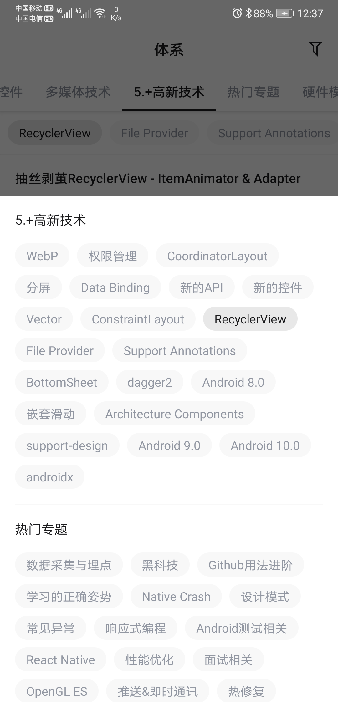</td>
<td bgcolor=#dfe2e5>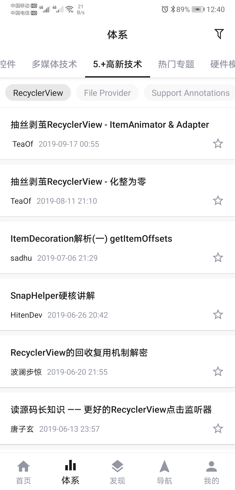</td>
<td bgcolor=#dfe2e5>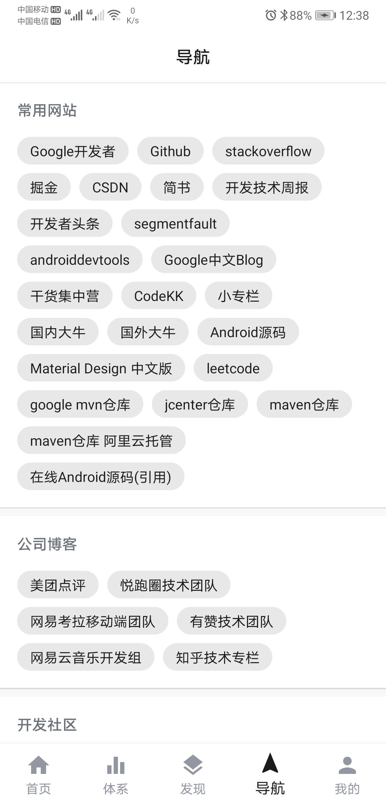</td>
</tr>
<tr>
<td bgcolor=#dfe2e5>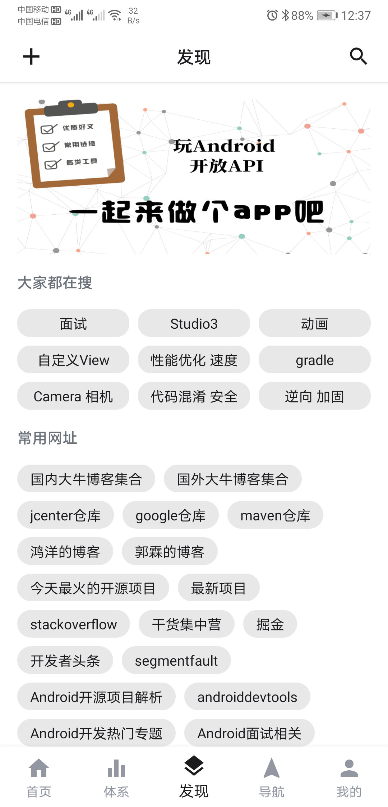</td>
<td bgcolor=#dfe2e5>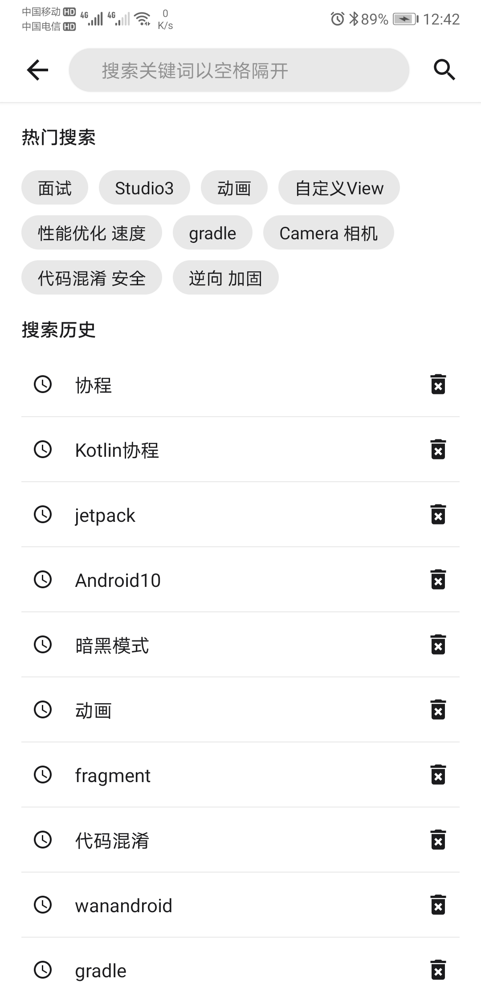</td>
<td bgcolor=#dfe2e5>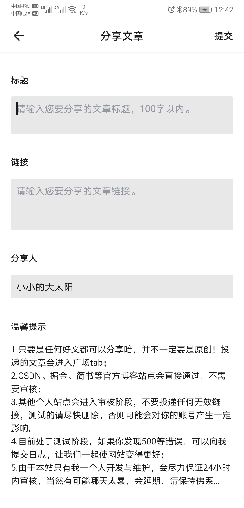</td>
</tr>
<tr>
<td bgcolor=#dfe2e5>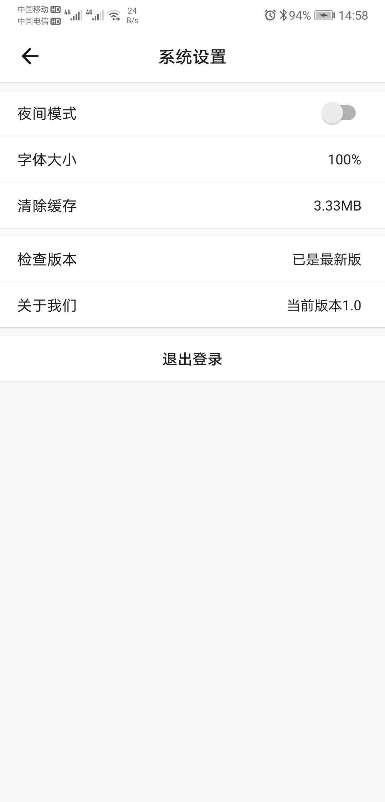</td>
<td bgcolor=#dfe2e5>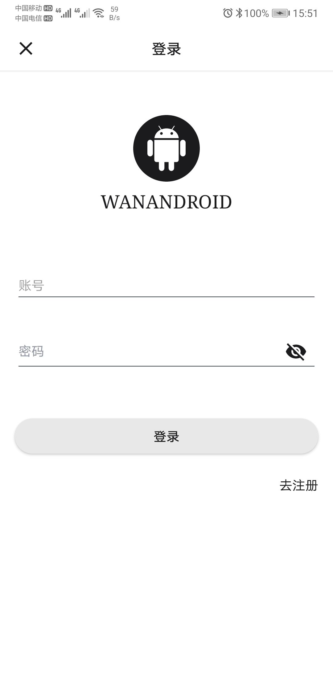</td>
<td bgcolor=#dfe2e5>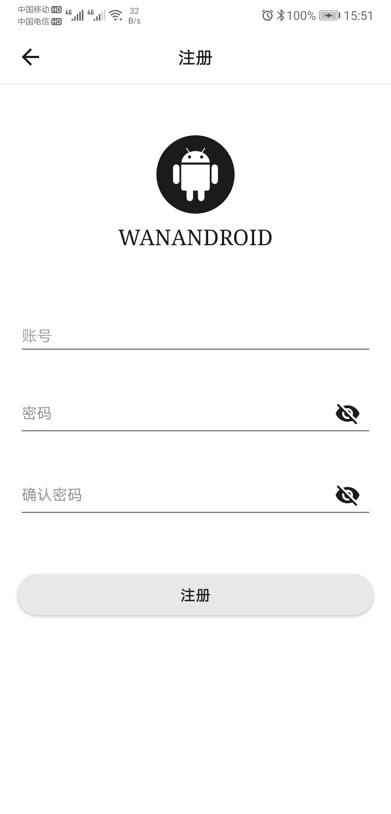</td>
</tr>
<tr>
<td bgcolor=#dfe2e5>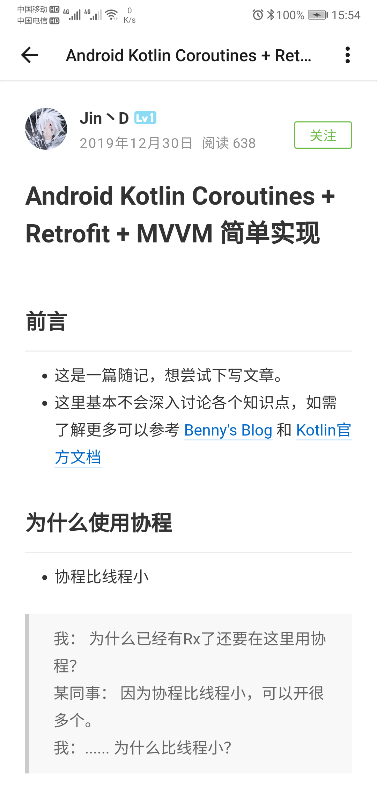</td>
<td bgcolor=#dfe2e5>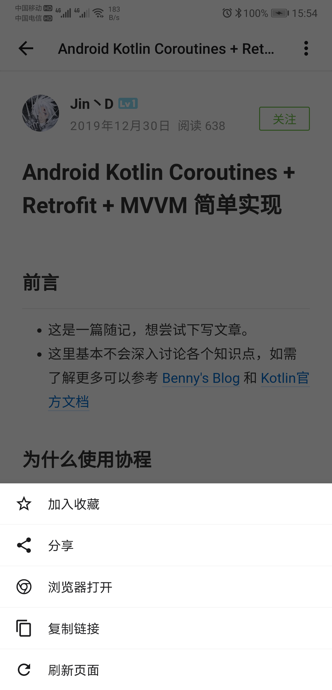</td>
<td bgcolor=#dfe2e5>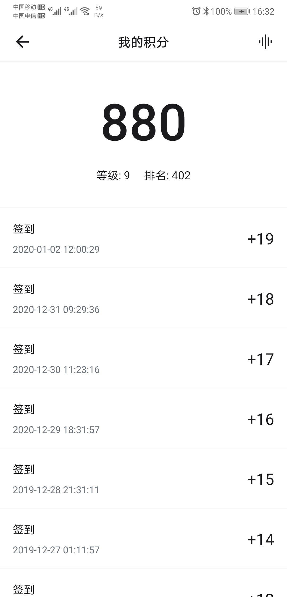</td>
</tr>
<tr>
<td bgcolor=#dfe2e5>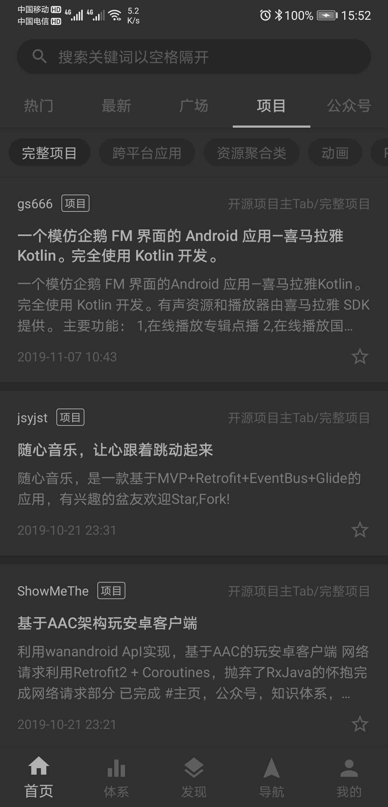</td>
<td bgcolor=#dfe2e5>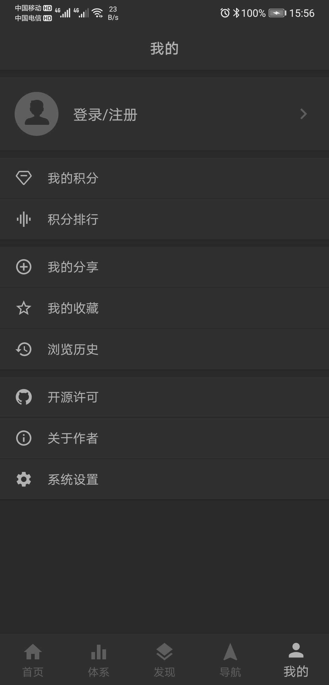</td>
<td bgcolor=#dfe2e5>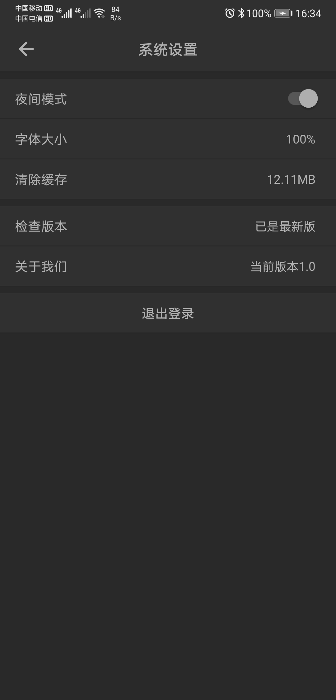</td>
</tr>
</table>
