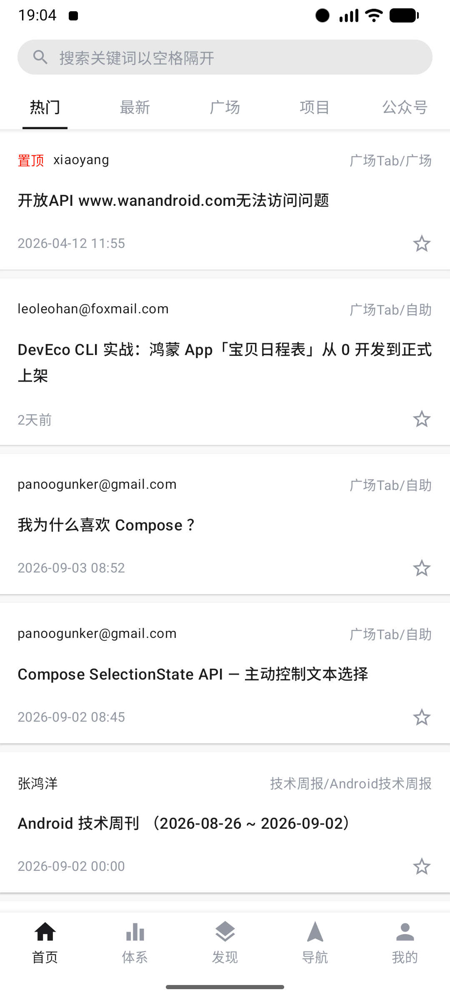
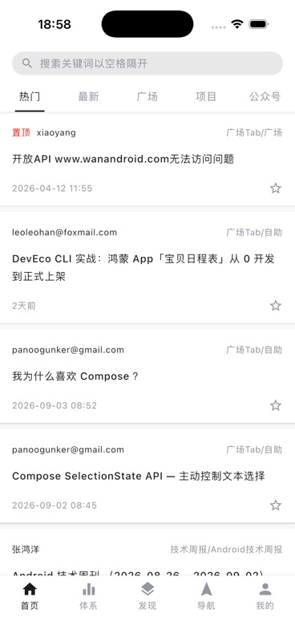
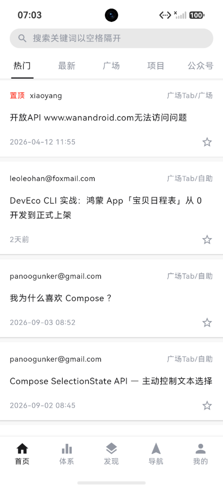

# Compose Multiplatform 迁移

## 范围与架构

共享原有 Compose 页面、布局参数、主题、资源、导航栈及 Repository / ViewModel。平台差异限定在入口、网络引擎、本地存储、网页容器、返回事件、系统栏和图片解码能力。

| 目录 | 职责 |
| --- | --- |
| `composeApp/src/commonMain` | 原有业务、UI、导航、主题、资源、API、状态和存储接口 |
| `composeApp/src/commonTest` | 原有交互状态测试及新增网络契约、HTML 文本测试 |
| `app`、`composeApp/src/androidMain` | Android 入口、Room、SharedPreferences、OkHttp、WebView、系统栏 |
| `iosApp`、`composeApp/src/iosMain` | SwiftUI 宿主、Darwin HTTP、NSUserDefaults、WKWebView |
| `web`、`composeApp/src/wasmJsMain` | Wasm 入口、浏览器存储、返回事件、iframe、同源代理、中文字体 |
| `harmony`、`composeApp/src/ohosMain` | CPF-KMP-CMP 构建、OHOS 存储、NetworkKit 引擎、ArkUI 互操作 |
| `harmonyApp` | ArkUI 宿主、原生控制器注册、N-API、HTTP 和 ArkWeb 桥接 |

`harmony` 直接引用 `../composeApp/src/commonMain/kotlin` 和共同资源，不维护另一套页面。检查 CPF `org.jetbrains.compose.ui:ui:1.9.2-1.0.0` 的发布元数据后确认该发行版没有 Web 目标，因此官方构建与鸿蒙构建分离。

### 依赖组合

| 组件 | Android / iOS / Web | HarmonyOS |
| --- | --- | --- |
| Gradle | 9.4.1 | 8.14.3 |
| Kotlin | 2.3.20 | 2.2.21-1.0.0 |
| Compose Multiplatform | 1.10.3 | 1.9.2-1.0.0 |
| Lifecycle | 2.10.0 | 2.9.4-1.0.0 |
| Navigation 3 | 1.1.1 | 1.9.2-1.0.0 |
| Ktor | 3.3.3 | 3.3.3-1.0.0 |
| Coil | 3.3.0 | 3.3.0-1.0.0 |
| kotlinx.serialization | 1.9.0 | 1.9.1-1.0.0 |
| 宿主 | AGP 9.2.1 / Xcode / Node.js | OHPM Compose 1.9.2-1.0.0 |

Android 保留原 `applicationId`、渠道/环境、签名配置、版本、minSdk 23、compileSdk/targetSdk 36。iOS 提供 `iosArm64` 和 `iosSimulatorArm64`；鸿蒙提供 `ohosArm64`，宿主兼容 SDK 5.0.5(API 17)。这些配置下限不代表已逐一验证最低版本设备。

## 关键实现与兼容处理

- API 全部移到 Ktor，保留原接口路径、分页起点、表单字段和业务错误。对 `data: null` 的写操作单独处理，避免收藏/分享成功后被当成解析错误。
- 响应显式按 UTF-8 字节解析，并切到平台后台 Dispatcher。鸿蒙平台分支中的字符集转换曾在大型中文分类响应上阻塞主线程；改动后体系页面在模拟器正常加载，未再出现同一阻塞。
- 鸿蒙的 HTTPS 使用 NetworkKit，Ktor 负责请求、Cookie 和超时。N-API 请求、完成、取消均回到 ArkTS 所属主线程；页面销毁释放未完成请求。保留多个 `Set-Cookie` 响应头。
- Android 读取原 SharedPreferences，并在首次启动导入 PersistentCookieJar 数据。阅读历史继续使用原 Room 数据库及字段映射；迁移前后的数据库 identity hash 均为 `2ea3e540e4f7ee0c3a2eac8229e8ec4a`。
- iOS、Web、鸿蒙使用平台持久化 JSON 保存账号、搜索、历史和设置。鸿蒙文件写入经锁保护并使用临时文件替换；历史更新和 Cookie 更新分别互斥。
- 页面事件改为进程内 Flow/StateFlow，配合 ViewModel 生命周期。鸿蒙 Navigation 3 使用对应版本的 ViewModel 装饰器；路由退出时清理 ViewModel。
- ArticleCard 统一接收长按回调，避免外层长按与卡片点击竞争，覆盖分享与阅读历史删除入口。
- Android、iOS、鸿蒙分别用 WebView、WKWebView、ArkWeb 加载详情。平台容器按页面生命周期释放；文章字号取共同设置；Android/鸿蒙为文字缩放，iOS/Web 为整页缩放。
- Web 使用同源 `/api` 代理管理 HttpOnly Cookie，图片经有限域名白名单代理。浏览器返回通过 `NavigationEventInput` 进入 Compose 分发器，使弹窗优先处理返回；Escape 由 Compose 处理。
- 图片统一使用 Coil 3 与共享 HTTP 客户端，保留 200ms 渐显，注册 SVG；Android 保留 GIF 和视频帧解码模块。Web 预加载本地 Noto Sans CJK SC 常规字体和 Noto Color Emoji，避免中文及表情缺字。图片模型使用同源绝对地址，使 Coil 正确选择网络 Fetcher。
- iOS 的 Xcode 工程从 `BUILT_PRODUCTS_DIR` 引用 Gradle 生成的 framework 链接，配置共享库搜索路径，并声明源库及构建产物的脚本输出；共享库更新后重新链接宿主，避免继续安装旧代码。

## 构建与运行

以下命令均从仓库根目录执行，除非明确使用 `cd`。

### Android

安装 JDK 17、Android SDK 36 和模拟器，配置本机 `local.properties`。本次使用 JetBrains Runtime 17.0.14。

```bash
./gradlew help
./gradlew :composeApp:testAndroidHostTest :app:testEnterpriseAlphaDebugUnitTest :app:assembleEnterpriseAlphaDebug
adb install -r app/build/outputs/apk/enterpriseAlpha/debug/wandroid_enterprise_alpha_v1.0.6_20260514.apk
adb shell am start -n com.xiaojianjun.wanandroid/.ui.compose.MainComposeActivity
```

其他渠道/环境继续使用原有 flavor 任务。覆盖安装不要使用 `adb uninstall`，否则无法验证旧数据保留。

### iOS

在 macOS 安装 Xcode 和 iOS Simulator 后打开 `iosApp/iosApp.xcodeproj`，选择 `iosApp` scheme 运行。Xcode 的构建阶段自动执行共享 framework 构建与资源同步。

```bash
xcodebuild -project iosApp/iosApp.xcodeproj -scheme iosApp \
  -configuration Debug -sdk iphonesimulator \
  -destination 'generic/platform=iOS Simulator' \
  -derivedDataPath /tmp/wanandroid-ios-derived CODE_SIGNING_ALLOWED=NO build
```

模拟器不需要开发团队签名。真机和归档需在 `iosApp/Configuration/Config.xcconfig` 配置开发团队，并使用有效签名。当前提供 Apple Silicon 模拟器目标，未提供 Intel `iosX64`。

### Web

安装 Node.js 22 或更新版本。本次验证使用 Node.js 24.14.1、Chromium 152.0.7977.76。

```bash
./gradlew :composeApp:wasmJsBrowserDistribution
node --test web/server.test.mjs
node web/server.mjs
```

访问 `http://127.0.0.1:8080`。产物目录为 `composeApp/build/dist/wasmJs/productionExecutable`，服务默认读取该目录。支持 `PORT` 和 `WANANDROID_WEB_DIST` 环境变量覆盖。

需要支持 Wasm GC 的浏览器。静态文件与 API 代理必须同源，直接以 `file://` 打开无效。服务器仅监听回环地址；部署时由 HTTPS 反向代理转发，并设置 `X-Forwarded-Proto: https`，以保留安全 Cookie 属性。未执行公网部署。

中文和 Emoji 字体的 OFL 许可证位于 `composeApp/src/wasmJsMain/resources/licenses/`，随 Web 产物一起输出。

### HarmonyOS

安装 DevEco Studio、HarmonyOS SDK、ohpm、hvigor。将 `OHOS_SDK_HOME`、`DEVECO_SDK_HOME` 指向 DevEco 的 SDK 目录。本机二者为 `/Applications/DevEco-Studio.app/Contents/sdk`。

```bash
./harmony/gradlew -p harmony publishDebugBinariesToHarmonyApp
cd harmonyApp
ohpm install
hvigorw --mode module -p product=default -p module=entry@default -p buildMode=debug assembleHap --no-daemon
hdc install -r entry/build/default/outputs/default/entry-default-unsigned.hap
hdc shell aa start -a EntryAbility -b com.xiaojianjun.wanandroid
```

也可以在 DevEco Studio 打开 `harmonyApp`，安装 OHPM 依赖后运行。`publishDebugBinariesToHarmonyApp` 会生成 `libwanandroid.so`、C 头文件和共享资源；这些生成物不提交。修改共同源码后，需要先执行该 Gradle 任务，再构建 HAP。

当前任务生成的是模拟器已安装验证的 Debug HAP。真机安装、Release 签名和上架需配置相应证书，未在此次验证范围内。

## 验证结果

验证日期：2026-09-06。构建、静态测试、模拟器和真实账号验证分开记录。

### 构建与测试

| 检查 | 结果 |
| --- | --- |
| 原 Android 基线 `help`、宿主单测、Debug APK | 通过 |
| 迁移后 `help`、Android APK | 通过 |
| 共享 Kotlin 测试 | 32 项通过，0 失败 |
| Android 宿主单测 | 1 项通过，0 失败 |
| iOS framework + 模拟器 App 构建/安装/启动 | 通过，验证共享代码变更会重新链接 |
| Web Wasm production distribution | 通过 |
| Node.js 代理测试 | 6 项通过，0 失败 |
| 鸿蒙原生库 + HAP 构建/安装/启动 | 通过 |
| `git diff --check` | 通过 |

共享测试覆盖原有首页/体系/导航状态逻辑、图片地址规范化、HTML 实体及带引号的标签属性、跨年日期，以及空响应写操作、UTF-8 表单、大型中文与表情响应、分页、长 ID、数字类型兼容、账号过期和旧账号 JSON 兼容。代理测试覆盖静态 MIME/HEAD、空字符路径、上游响应中断后服务可用性、来源和地址白名单、Cookie/表单转发、HTTPS Cookie、会话清理、图片域名隔离。

### 实际设备和浏览器

| 平台 | 环境 | 实际执行的主要回归 |
| --- | --- | --- |
| Android | Resizable_Experimental，Android 17 / API 37 | 五个主页基线对比；详情、搜索；旧 APK 升级保留历史、夜间模式及 127% 字号；阅读历史长按删除；最终 APK 冷启动 |
| iOS | iPhone 17 Pro，iOS 26.5 Simulator | 五个主页面、真实文章 WKWebView、搜索和返回历史、阅读历史持久化及长按删除、夜间模式、字号设置与冷启动保留 |
| HarmonyOS | nova 16 模拟器，系统报告 OpenHarmony-7.0.0.105 | 五个主页面、体系分类、项目图文、中文热搜及搜索结果/历史、ArkWeb 详情、返回、夜间模式、字号、缓存清理、冷启动持久化；大中文响应阻塞修复后复查 |
| Web | Chromium 152，430×932 与桌面宽度 | 真实首页/分类/站点/搜索/详情，主题与字号；浏览器返回；使用隔离模拟接口完成账号及写操作回归 |

Android 迁移前后五个主页面的文本、控件描述及布局边界曾逐项对照。字体渲染、安全区和系统控件由各端系统决定，不能据此宣称四端像素完全相同。

浏览器隔离模拟接口验证了登录、注册、登录信息刷新后保留、积分/排行、收藏及取消、分享提交/列表、长按删除、退出清理、`-1001` 过期引导，以及返回先关闭弹窗。模拟账号和文章没有发送到真实服务；未提供真实测试账号，因此未完成四端真实登录 Cookie 与服务端写操作闭环。

### 实际运行截图

更新后的 Android / iOS / HarmonyOS 完整并排图库见 [三端运行截图](screenshots/README.md)，包含采集环境、页面目录与真实账号截图的范围说明。

| Android | iOS |
| --- | --- |
|  |  |

| HarmonyOS | Web |
| --- | --- |
|  |  |

Web 项目封面和中文、Emoji 显示实测：[项目页截图](verification/web-project.png)。

### 已知限制与未验证范围

1. **Compose Web 无障碍树**：1.10.3 的 `ComposeWebSemanticsListener` 仅保存最后一个 SemanticsOwner。弹窗关闭后未恢复根 owner，ARIA 树可能为空或停留在旧页面；实际画面、鼠标点击及浏览器返回仍正常。已用截图和真实坐标点击补验后续流程，但 Web 读屏器支持仍不完整。已查阅 1.11.1、1.12.0 同一类源码，仍存在这一实现；当前依赖下尚未解决。
2. **Web 文章嵌入**：GitHub 等网站通过 CSP / X-Frame-Options 禁止 iframe，浏览器无法强制内嵌。详情右上角提供外部打开入口；Android、iOS、鸿蒙仍使用各自原生网页容器。
3. **图片格式能力**：Coil 官方 GIF 动画和视频帧扩展仅支持 Android。四端静态图片和 SVG 已接入；非 Android 的 GIF 动画/视频缩略图不宣称与 Android 完全等同。本次实际接口图片主要为静态图，未逐格式构造四端媒体回归集。
4. **文章字号**：Android `WebSettings.textZoom`、鸿蒙 `textZoomRatio` 只调整文字；iOS `WKWebView.pageZoom` 和 Web iframe 比例缩放会连同图片及布局一起缩放。设置值与持久化相同，实际呈现方式不完全相同。跨域 iframe 无法直接修改目标文档字体。
5. **缓存清理**：Android 统计并清理内部/外部 cache 目录，额外清理 Coil 内存；iOS 统计 Caches 目录的普通文件，清理该目录、NSURLCache 和 Coil；鸿蒙统计并清理 Coil 内存及磁盘；Web 统计并清理 Coil 内存缓存。各端都保留账号、设置及历史。原生网页容器的独立网站数据、浏览器 HTTP 缓存不在统一清理范围内，当前缓存数字不能跨平台直接比较。
6. 未执行物理真机、最低系统版本、所有浏览器/机型、Release 签名、应用商店发布和公网部署。构建通过不替代这些验证。
7. Web 包含本地中文字体及 Skia/Wasm 资源，首次加载体积较大；本次未做首屏性能专项优化。

## 本次复审修正

- HTML 实体支持名称中的数字（如 `&frac12;`），正确处理标签属性中的 `>`，并复用正则，减少文章列表重复创建对象。
- 积分日期使用日历年 `yyyy`，避免跨年周显示成前一年或后一年；补充边界测试。
- iOS 详情随请求地址更新，释放时停止加载；Web iframe 保留实例，地址、字号和布局分别更新，避免重建后丢失尺寸或重复加载。
- Android 阅读历史删除与标签删除放入同一事务；鸿蒙图片缓存读写移到后台 Dispatcher；iOS 缓存统计排除目录自身大小。
- 删除未被订阅的 ViewModel 事件流、无引用的旧依赖声明和资源类型导入；Web 返回分发与 iframe 分文件维护，开源列表更新为当前依赖。
- Web 字体或入口脚本加载失败时显示系统字体的重试入口，避免一直停留在加载状态。浏览器已实测字体失败后重试恢复、130% 文章显示、窗口变化保持同一 iframe 且不重复请求、返回释放和切换文章。
- Web 代理拒绝含空字符的路径，处理上游响应流中断，避免单个无效请求或网络断流退出服务；新增异常回归。
- 最终复审包再次完成 Android 历史删除及冷启动保留、iOS 原生文章显示和缓存 5.74MB → 0B、鸿蒙缓存 1.35MB → 0B 和开源列表交互验证。

### 截图采集补充复核（2026-09-06）

- 采集 Android、iOS、HarmonyOS 各 20 张真实截图，按相同页面整理为[三端图库](screenshots/README.md)。登录和注册未提交，登录后的个人数据页面不计入截图覆盖。
- 通过 iOS 开源列表发现此前安装包仍链接旧代码。修正 framework 引用和搜索路径、补充构建产物输出后，检查最终 `WanAndroid.debug.dylib` 已包含当前依赖列表，模拟器页面与源码一致；单独更新生成库的时间戳，再次构建也触发了 `Ld`，验证增量链接。新包重新完成 20 个页面采集和缓存 `6.23MB → 0B` 清理验证。此前仅凭构建成功作出的更新生效判断不充分；共享库搜索路径参见 [JetBrains 直接集成说明](https://blog.jetbrains.com/kotlin/2021/07/multiplatform-gradle-plugin-improved-for-connecting-kmm-modules/)。
- Android 文章首次进入时，WebView 曾擦掉标题栏，恢复前台后才重绘。网页容器增加 `clipToBounds()` 后，Debug APK 构建通过，模拟器首次进入、点击顶部返回及再次进入均显示正常；图库已使用修复后的截图。`AndroidView` 默认不裁剪内容，参见 [Android 官方互操作 API](https://developer.android.com/reference/kotlin/androidx/compose/ui/viewinterop/package-summary)。

## 维护与发布

- 官方三端共享依赖在 `gradle/libs.versions.toml` 与 `composeApp/build.gradle.kts`，鸿蒙版本在 `harmony/build.gradle.kts`、`harmonyApp/oh-package.json5` / lockfile。升级时需同时验证两个 Gradle 构建，不能直接混用两套原生依赖。
- 发布版本需同步 Android `app/build.gradle.kts`、iOS `iosApp/Configuration/Config.xcconfig`、鸿蒙 `harmonyApp/AppScope/app.json5`，以及 Web/鸿蒙 `Platform.versionName`。当前版本均为 `1.0.6`，原生宿主 build/versionCode 为 `20260514`。
- 不提交构建目录、生成的 framework / so / C 头文件 / HAP、模拟器数据和本机 SDK 配置。保留 Gradle wrapper、Kotlin/JS yarn lockfile、OHPM lockfile 及字体许可证。
- 账号写操作回归应使用专用测试账号，并分别验证各端 Cookie 持久化、退出、过期、收藏、分享及删除。当前仓库没有真实测试账号配置。

## 参考与许可

- [JetBrains 平台与版本兼容说明](https://kotlinlang.org/docs/multiplatform/compose-compatibility-and-versioning.html)
- [CPF-KMP-CMP 示例](https://gitcode.com/CPF-KMP-CMP/kmp-cmp-example/tree/cmp-example)
- [鸿蒙版本说明](https://gitcode.com/CPF-KMP-CMP/docs/blob/main/zh-cn/入门/版本说明.md)
- [Coil GIF 支持范围](https://coil-kt.github.io/coil/gifs/)
- [Coil SVG](https://coil-kt.github.io/coil/svgs/)
- [Compose Web 1.10.3 官方源码包](https://repo.maven.apache.org/maven2/org/jetbrains/compose/ui/ui-wasm-js/1.10.3/ui-wasm-js-1.10.3-sources.jar)
- [Noto CJK 字体项目](https://github.com/notofonts/noto-cjk)
- [Noto Emoji 字体项目](https://github.com/googlefonts/noto-emoji)
