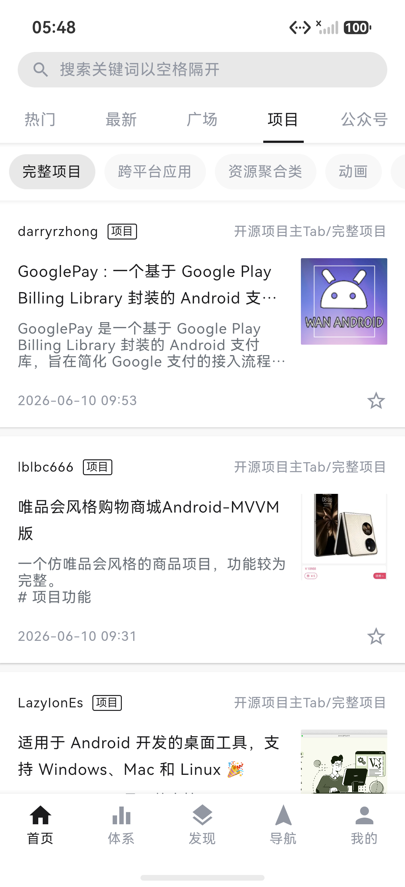
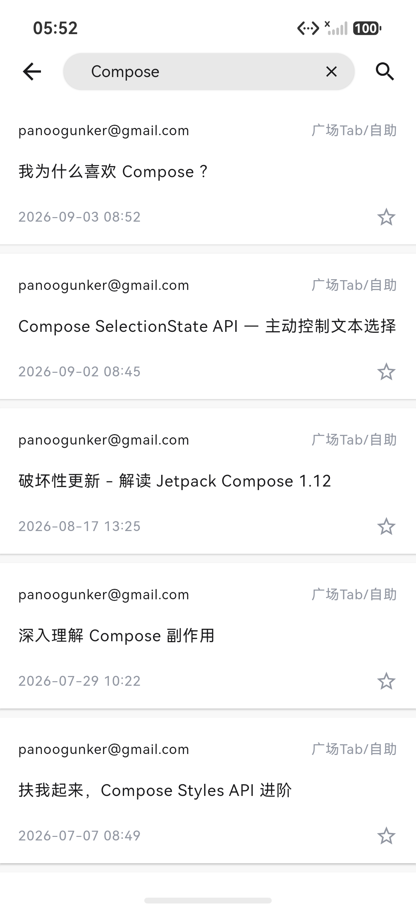
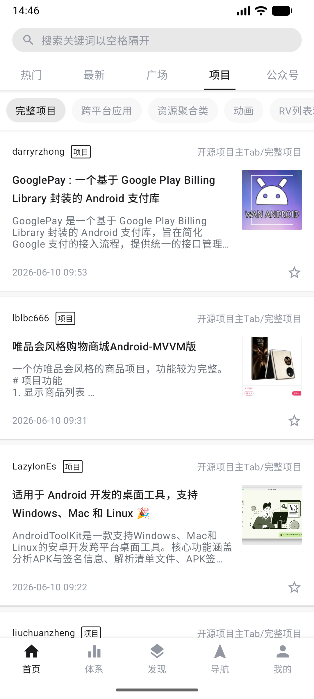
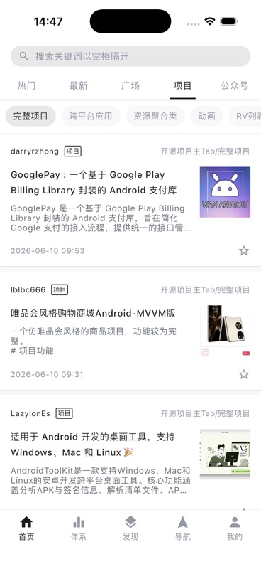
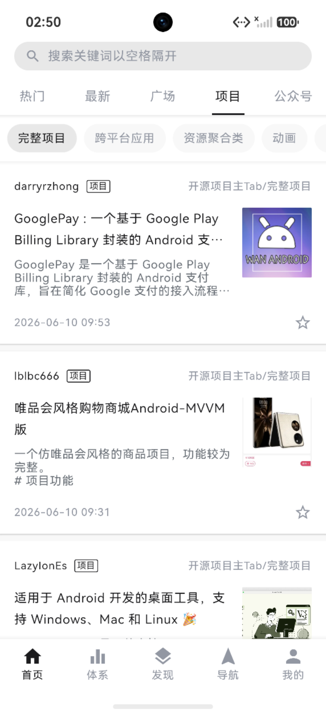

# Compose Multiplatform 迁移

## 范围与架构

共享原有 Compose 页面、布局参数、主题、资源、导航栈及 Repository / ViewModel。当前完整的模块层级和构建入口见 [README 工程目录](../README.md#工程目录)。根 Gradle 只注册 `shared`、`androidApp`，`shared` 统一 Android、iOS、OHOS 目标。iOS 使用 Xcode 宿主，HarmonyOS 使用 Hvigor 宿主；Web 在 `webApp` 使用独立 Gradle 构建。平台适配覆盖入口、网络引擎、本地存储、网页容器、返回事件、系统栏和图片解码能力，滚动反馈保留各平台默认实现。

| 目录 | 职责 |
| --- | --- |
| `shared/src/commonMain` | 原有业务、UI、导航、主题、资源、API、状态和存储接口 |
| `shared/src/commonTest` | 原有交互状态测试及新增网络契约、HTML 文本测试 |
| `androidApp`、`shared/src/androidMain` | Android 入口、Room、SharedPreferences、OkHttp、WebView、系统栏 |
| `iosApp`、`shared/src/iosMain` | SwiftUI 宿主、Darwin HTTP、NSUserDefaults、WKWebView |
| `shared/src/nativeMain` | iOS 与 OHOS 共用的导航条目 ViewModel 生命周期适配 |
| `shared/src/wasmJsMain` | 浏览器存储、返回事件、iframe 等共享库平台适配 |
| `webApp` | 独立 Gradle / Wrapper / 版本目录、Wasm 入口、Webpack、HTML、中文与 Emoji 字体和许可证 |
| `webApp/web` | Node.js 静态产物托管、同源 API / 图片代理及代理测试 |
| `shared/build.gradle.kts`、`shared/src/ohosMain` | OHOS 共享库编译、存储、CPF Curl 引擎、ArkUI 互操作 |
| `harmonyApp` | ArkUI 宿主、原生控制器注册、N-API 和 ArkWeb 桥接 |
| `.run` | Web、HarmonyOS 共享 Shell Script 运行配置 |

移动三端统一使用 CPF Kotlin / Compose，OHOS 产物由根 `:shared:publishDebugBinariesToHarmonyApp` 发布到 `harmonyApp/entry`。CPF `org.jetbrains.compose.ui:ui:1.9.2-1.0.0` 发布元数据包含 Android、iOS 和 OHOS，没有 JS/Wasm 变体，因此 Web 保留独立 JetBrains 工具链，直接编译 `../shared/src/commonMain` 与 `../shared/src/wasmJsMain`，不复制业务源码。

以下 2026-09-07 小节保留调整历史；当前目录、版本和命令以本页“范围与架构”“依赖组合”“构建与运行”为准。

### 对齐 JetBrains 新默认结构（2026-09-07）

按[官方模块结构指南](https://kotlinlang.org/docs/multiplatform/multiplatform-project-recommended-structure.html)将原共享模块命名为 `shared`，Android 宿主命名为 `androidApp`，新增独立 `webApp`。共享 UI、业务和 `expect/actual` 留在共享库，各平台应用模块消费共享库并负责启动、应用资源和打包。

- `shared` 保留 Android Library、iOS framework 与 Wasm 库目标，移出 Wasm 可执行文件、Webpack 配置和浏览器入口。
- `webApp` 依赖 `shared`，单独包含入口、HTML、favicon、中文/Emoji 字体及许可证。字体使用独立资源包，公共图片与文案由共享库提供。
- `iosApp` 的 Gradle 任务、framework 搜索路径及增量链接输出切换到 `shared`。Android 包名、渠道和版本保持原约定。
- `model/repository` 统一存放数据访问代码。`AppContainer` 创建 Repository，ViewModel 通过构造函数接收所需依赖；`appViewModel` 复用当前导航条目的 ViewModelStore。
- 阅读历史、搜索历史依赖通过存储接口传入，可使用内存实现测试；生产环境沿用各端现有持久化方式。新增测试覆盖注入网络后的首页加载与置顶顺序、详情与历史共享存储，以及本地搜索历史。
- 四端共用 Compose UI，单个共享模块足够；鸿蒙因配套编译器不同保留独立 Gradle 构建，直接读取 `shared` 的源码和资源。

本次对齐工程职责和依赖组织，调整时的构建与回归结果在验证章节单独记录。下表维护当前构建声明的依赖版本，截图与历史验证保留各自的采集时间和版本基线。

### 平台配套工程归档（2026-09-07）

- 将根目录的 `harmony` 收入 `harmonyApp/harmony`，保留独立 Gradle Wrapper 与 CPF 依赖配置；源码和资源从 `../../shared` 读取，编译产物发布到 `../entry`，再由 DevEco / hvigor 打包。
- 将根目录的 `web` 收入 `webApp/web`，服务脚本根据自身位置定位仓库根目录，默认托管 `webApp/build/dist/wasmJs/productionExecutable`。`WANANDROID_WEB_DIST` 的相对路径仍以仓库根目录为基准。
- 目录按所属平台归档，构建职责保持独立：`webApp` 编译 Wasm，Node.js 服务托管产物并代理接口；鸿蒙 Gradle 编译共享代码，hvigor 打包应用。此嵌套方式是本项目的组织约定。
- 归档后验证通过：主工程 Gradle 配置、Android APK、Web distribution、鸿蒙共享库与 HAP、6 项 Web 代理测试。核对 `.so`、头文件和 25 个共享资源均发布到正确位置；鸿蒙模拟器重新安装后，首页和项目图文正常。Web 服务从新路径在 `http://127.0.0.1:8080` 启动，Chrome 152 / 1280×720 实测首页进入项目页，字体、图片和列表正常，控制台无错误。此次仅调整目录与路径，iOS 沿用前一节的构建和运行验证。

### 依赖组合

当前移动端版本以根 `gradle/libs.versions.toml` 和 Wrapper 为准，Web 版本在 `webApp/gradle`；鸿蒙 ArkUI 宿主依赖仍由 `harmonyApp/oh-package.json5` 管理。

| 组件 | Android / iOS / HarmonyOS | Web |
| --- | --- | --- |
| Gradle | 8.14.3 | 9.7.1 |
| Kotlin | 2.2.21-1.0.0 | 2.4.10 |
| Compose Multiplatform | 1.9.2-1.0.0 | 1.12.0 |
| Coroutines | 1.10.2-1.0.0 | 1.11.0 |
| Lifecycle | 2.9.4-1.0.0 | 2.10.0 |
| Navigation 3 | 1.9.2-1.0.0 | 1.1.1 |
| Ktor | 3.3.3-1.0.0 | 3.3.3 |
| Coil | Android 3.3.0；iOS / OHOS 3.3.0-1.0.0 | 3.3.0 |
| kotlinx.serialization | 1.9.1-1.0.0 | 1.9.0 |
| 宿主 | AGP 8.11.1 / Xcode / OHPM Compose 1.9.2-1.0.0 | Node.js |

Android 保留原 `applicationId`、渠道/环境和应用版本，minSdk 仍为 23。为配套 CPF 编译器，AGP 调整为 8.11.1，compileSdk/targetSdk 从 37 调整为其[官方支持上限 36](https://developer.android.com/build/releases/agp-8-11-0-release-notes)。这会改变 Android 的目标版本行为基线，不影响安装到 API 37 设备；最低版本设备仍需单独回归。

iOS 提供 `iosArm64` 和 `iosSimulatorArm64`；鸿蒙提供 `ohosArm64`，宿主兼容 SDK 为 5.0.5(API 17)、目标 SDK 为 26.0.0。

CPF 版 Coil 的 Android AAR 使用 JVM 18 字节码，GIF 扩展还引入 minSdk 24 的 Skiko。根构建根据 Android 平台属性将 Coil 依赖统一解析为原官方 3.3.0，保留 JVM 11、API 23 及 Android GIF / 视频帧解码；Native 目标继续使用 CPF Coil。Android Navigation 3 的 ViewModel 装饰器继续使用官方 `lifecycle-viewmodel-navigation3:2.10.0`，其余平台适配见下文。

## 关键实现与平台适配

- API 全部移到 Ktor，保留原接口路径、分页起点、表单字段和业务错误。对 `data: null` 的写操作单独处理，避免收藏/分享成功后被当成解析错误。
- 响应显式按 UTF-8 字节解析，并切到平台后台 Dispatcher。鸿蒙平台分支中的字符集转换曾在大型中文分类响应上阻塞主线程；改动后体系页面在模拟器正常加载，未再出现同一阻塞。
- 移动三端共用 Ktor 请求、Cookie 和超时配置，Android / iOS / 鸿蒙分别选择 OkHttp / Darwin / CPF Curl 引擎。鸿蒙的 `ktor-client-curl:3.3.3-1.0.0` 包含 OHOS 的 libcurl、OpenSSL 静态库，直接处理 HTTPS、响应头、流式请求与取消，保持默认的证书链及主机名校验。API 和 Coil 共用客户端，已移除自定义 NetworkKit HTTP 服务及请求、取消、完成的 N-API 桥接；客户端由共享层持有，其生命周期不再依赖 ArkUI 页面的显示与隐藏。
- CPF Curl 发布版的取消分支直接释放句柄却保留内部登记，超时/取消后关闭客户端会触发 `CURLM_BAD_EASY_HANDLE` 崩溃。`shared/thirdParty/ktor-curl` 修正事件循环的取消调度、及时处理完成队列、统一释放回调资源，并忽略已释放句柄的延迟背压恢复；其余引擎源码由 Gradle 从固定版本源码包提取，C interop 与原生库保持 CPF 发布产物。升级时需核对发布版是否已修复，并移除本地替换，详见[修复说明](../shared/thirdParty/ktor-curl/README.md)。
- Android 使用 SharedPreferences 保存账号、搜索和设置，使用 Room 保存阅读历史。当前版本不承担旧持久化数据迁移：已移除 PersistentCookieJar 导入、一次性迁移标记和相关依赖；Cookie 统一由 Ktor 的共享持久化实现保存。
- iOS、Web、鸿蒙使用平台持久化 JSON 保存账号、搜索、历史和设置。鸿蒙文件写入经锁保护并使用临时文件替换；历史更新和 Cookie 更新分别互斥。
- 页面事件改为进程内 Flow/StateFlow，配合 ViewModel 生命周期。CPF 未发布 Native 版 `lifecycle-viewmodel-navigation3`，iOS 与 OHOS 共用 `nativeMain` 中的装饰器：暂时离开组合时保留页面状态，条目出栈时清理 ViewModel，导航宿主销毁时兜底清理。
- ArticleCard 统一接收长按回调，避免外层长按与卡片点击竞争，覆盖分享与阅读历史删除入口。
- Android、iOS、鸿蒙分别用 WebView、WKWebView、ArkWeb 加载详情。平台容器按页面生命周期释放；文章字号取共同设置；Android/鸿蒙为文字缩放，iOS/Web 为整页缩放。
- Web 使用同源 `/api` 代理管理 HttpOnly Cookie，图片经有限域名白名单代理。浏览器返回通过 `NavigationEventInput` 进入 Compose 分发器，使弹窗优先处理返回；Escape 由 Compose 处理。
- 图片统一使用 Coil 3 与共享 HTTP 客户端，保留 200ms 渐显，注册 SVG；Android 保留 GIF 和视频帧解码模块。Web 预加载本地 Noto Sans CJK SC 常规字体和 Noto Color Emoji，避免中文及表情缺字。图片模型使用同源绝对地址，使 Coil 正确选择网络 Fetcher。
- iOS 的 Xcode 构建阶段调用根 `:shared:embedAndSignAppleFrameworkForXcode`，同步 framework 与 Compose 资源。CPF 静态 framework 的无扩展名库文件未被当前 Xcode 链接器记录为输入，因此构建阶段按内容同步到 `BUILT_PRODUCTS_DIR/libWanAndroid.a`，并显式声明输出与静态链接依赖。无改动时不复制，共享代码变化时重新链接；Android Studio 已构建 framework 时也执行该同步。

## 构建与运行

以下命令均从仓库根目录执行，除非明确使用 `cd`。

### Android

安装 JDK 17、Android SDK 36 和模拟器，配置本机 `local.properties`。迁移回归时使用的 JDK 为 JetBrains Runtime 17.0.14。

```bash
./gradlew help
./gradlew :shared:testAndroidHostTest :androidApp:testEnterpriseAlphaDebugUnitTest :androidApp:assembleEnterpriseAlphaDebug
adb install -r androidApp/build/outputs/apk/enterpriseAlpha/debug/wandroid_enterprise_alpha_v1.0.6_20260514.apk
adb shell am start -n com.xiaojianjun.wanandroid/.ui.compose.MainComposeActivity
```

其他渠道/环境继续使用原有 flavor 任务。日常调试可覆盖安装；当前验收不要求从旧版应用升级保留数据。

### iOS

在 macOS 安装 Xcode 和 iOS Simulator 后打开 `iosApp/iosApp.xcodeproj`，选择 `iosApp` scheme 运行。Xcode 的构建阶段自动执行共享 framework 构建与资源同步。

```bash
xcodebuild -project iosApp/iosApp.xcodeproj -scheme iosApp \
  -configuration Debug -sdk iphonesimulator \
  -destination 'generic/platform=iOS Simulator' \
  -derivedDataPath /tmp/wanandroid-ios-derived CODE_SIGNING_ALLOWED=NO build
```

模拟器不需要开发团队签名。真机和归档需在 `iosApp/Configuration/Config.xcconfig` 配置开发团队，并使用有效签名。当前提供 Apple Silicon 模拟器目标，未提供 Intel `iosX64`。

### Web

安装 Node.js 22 或更新版本。迁移回归时使用 Node.js 24.14.1、Chromium 152.0.7977.76。

运行 `./webApp/web/run.sh` 可完成构建并启动本地服务，与 Android Studio 的 `webApp` 入口相同。也可分步构建、测试与启动：

```bash
./webApp/gradlew -p webApp wasmJsBrowserDistribution
node --test webApp/web/server.test.mjs
node webApp/web/server.mjs
```

访问 `http://127.0.0.1:8080`。产物目录为 `webApp/build/dist/wasmJs/productionExecutable`，服务默认读取该目录。支持 `PORT` 和 `WANANDROID_WEB_DIST` 环境变量覆盖。

需要支持 Wasm GC 的浏览器。静态文件与 API 代理必须同源，直接以 `file://` 打开无效。服务器仅监听回环地址；部署时由 HTTPS 反向代理转发，并设置 `X-Forwarded-Proto: https`，以保留安全 Cookie 属性。未执行公网部署。

中文和 Emoji 字体的 OFL 许可证位于 `webApp/src/wasmJsMain/resources/licenses/`，随 Web 产物一起输出。

### HarmonyOS

安装 DevEco Studio 26.0.0、配套 HarmonyOS SDK、ohpm、hvigor。将 `OHOS_SDK_HOME`、`DEVECO_SDK_HOME` 指向 DevEco 的 SDK 目录。本机二者为 `/Applications/DevEco-Studio.app/Contents/sdk`。

```bash
./harmonyApp/run.sh
node --test harmonyApp/run.test.mjs
```

脚本仅列出已连接设备：单设备自动选择，多设备可输入编号，也可通过 `HDC_DEVICE_ID` 固定目标。Android Studio 的 `harmonyApp` 共享入口调用此脚本；它不接入 Android 的设备下拉框。

脚本中的 `publishDebugBinariesToHarmonyApp` 生成 `libwanandroid.so`、C 头文件和共享资源；这些生成物不提交。也可以先执行 `./gradlew :shared:publishDebugBinariesToHarmonyApp`，再在 DevEco Studio 打开 `harmonyApp` 运行 `entry`；修改共享源码后需要重新执行该 Gradle 任务。

真机需要使用 DevEco 官方自动签名，确保 `default` 产品绑定对应签名方案，并将当前设备加入调试 Profile。配置步骤见 [README 的 HarmonyOS 运行说明](../README.md#harmonyos)。脚本优先安装本次构建的已签名 HAP；未签名 HAP 仅适用于允许未签名安装的模拟器。安装失败不会继续启动，设备端安装或启动报错即使伴随 hdc 退出码 0，脚本也会以非零状态结束。若报 `10106102`，请解锁手机并保持亮屏后重试。

`targetSdkVersion` 显式设为 `26.0.0`，保持当前 SDK 下已有产物的目标版本。调试签名和本机材料不提交；Release 签名与上架仍需单独配置，未在本次验证范围内。

## 验证结果

最近架构回归：2026-09-08。初次跨端迁移回归：2026-09-06。当时主工程使用 Gradle 9.4.1、Kotlin 2.3.20、Compose 1.10.3、AGP 9.2.1 和 compileSdk/targetSdk 36。当前依赖配置见[依赖组合](#依赖组合)，移动三端统一后的验证在下方单独记录。构建、静态测试、模拟器和真实账号验证分开记录。

### 鸿蒙切换 Curl（2026-09-08）

鸿蒙网络切换为 CPF Ktor `3.3.3-1.0.0` 的 Curl 引擎，删除 `HarmonyHttpEngine.kt`、ArkTS `HttpService.ets`、HTTP 专用 N-API 函数及类型声明，并删除留下的空 `network` 目录。宿主桥接保留系统栏和退出能力，网页容器继续使用 ArkWeb。

直接使用发布版时，独立 HAP 的请求断言通过，但超时/取消后关闭客户端会因重复清理句柄抛出 `CURLM_BAD_EASY_HANDLE` 并终止进程。仅恢复取消完成队列仍不能及时断开单个挂起连接，因此两个内部源码文件同时修正取消调度、队列处理和资源释放，并保护已释放句柄的延迟背压恢复。提交前 review 又复现并修复了响应头交付后提前注销取消监听、HTTP/1.0 错报为 HTTP/1.1 两个问题，补充回归后共 12 项通过。源码来源、构建方式与后续移除条件见[CPF Curl 修复说明](../shared/thirdParty/ktor-curl/README.md)。

| 检查 | 本次结果 |
| --- | --- |
| 根 `:shared:publishDebugBinariesToHarmonyApp` | 通过；源码提取、OHOS 编译、链接和发布通过，共享库与宿主中 `.so` 的 SHA-256 一致 |
| `:shared:testAndroidHostTest` | 检查通过；35 项既有测试结果为 0 失败，本次 `UP-TO-DATE` |
| Android APK / 宿主单测 | `assembleEnterpriseAlphaDebug` 与 `testEnterpriseAlphaDebugUnitTest` 检查通过；宿主 1 项既有测试为 0 失败，单测本次 `UP-TO-DATE` |
| Hvigor Debug HAP | 构建通过；同次未签名包成功覆盖安装到鸿蒙模拟器并启动，保留原应用数据 |
| 首页与项目页 | HTTPS API、中文内容和项目封面正常；将图片缓存清至 `0B` 后重启，封面可以重新下载 |
| 搜索与详情返回 | 通过 Curl 提交 `Compose` 查询，表单 POST、中文结果正常；文章网页可打开，返回后保留关键词与结果 |
| 独立 HAP 网络检查 | 下列 12 项通过，关闭后测试进程继续存活；[原始结果](verification/curl-20260908/network-checks.log) |

独立 HAP 使用相同版本的 CPF 依赖和相同的取消修复代码，通过真实 WanAndroid HTTPS 接口及仅监听本机的 HTTP/TLS 夹具验证：

1. 默认信任配置下的 HTTPS API 请求。
2. 两个独立 `Set-Cookie` 的完整接收及后续请求回传。
3. 中文、加号、空格、`&`、`=` 的表单编码及 UTF-8 响应。
4. HTTP 重定向。
5. 请求超时及其异常类型。
6. 请求取消和同一客户端的后续复用。
7. 默认校验拒绝临时自签名证书。
8. 仅有一个挂起请求时，取消后服务端在 1 秒内观察到 TCP 连接断开，不依赖后续请求触发清理。
9. HTTP/1.0 响应正确报告实际协议版本。
10. `Content-Length` 为 100、实际仅收到 7 字节时，拒绝截断的响应体。
11. 已收到响应头和部分正文后取消，服务端在 1 秒内观察到连接断开。
12. 取消之后关闭客户端，等待后台清理完成，无未捕获异常或进程崩溃。

测试夹具使用合成 Cookie 和表单，不访问真实账号。独立可执行文件曾因 CPF 绑定中的未解析符号无法链接，随后改用与应用相同的共享库/HAP 运行方式；该问题不影响最终应用的 HAP 构建。本轮复核了 Android APK 和单测，未重复构建 iOS / Web 或运行这三端页面，也未验证鸿蒙真机、最低系统版本或真实账号登录及收藏/分享写操作。提交前另行复跑鸿蒙启动脚本 17 项和 Web 代理 6 项，均通过；Web 测试首次因沙箱禁止监听本机端口失败，允许本机监听后复跑通过。

| 最终项目页 | 最终搜索结果 |
| --- | --- |
|  |  |

### 移动三端统一构建（2026-09-08）

- 根 `shared` 统一 Android Library、`iosArm64`、`iosSimulatorArm64`、`ohosArm64`。删除 `harmonyApp/harmony` 独立工程，鸿蒙运行脚本改为调用根共享库发布任务；保留设备选择、签名产物优先级和失败退出行为。
- Web 保留 JetBrains 工具链，Wrapper、版本目录和 Yarn 锁文件统一位于 `webApp`；共享业务和浏览器适配仍只保留在 `shared/src`。根 Gradle 不加载 Web 插件。
- iOS / OHOS 共享导航条目 ViewModel 生命周期和 CPF `BackHandler`。iOS 原来的新版返回 API 因宿主缺少 `NavigationEventDispatcher` 导致启动崩溃，切换配套 API 后真实首页、搜索、文章与返回正常。
- Xcode 已确认将 `libWanAndroid.a` 记录为链接输入。再次修改共享源码后，在同一次 Xcode 构建中完成 Kotlin 编译、framework 更新和宿主 `Ld`，库与同步后的 `.a` SHA-256 一致；无需清理 DerivedData。

| 检查 | 本次结果 |
| --- | --- |
| 根 Gradle `help` | 通过 |
| 共享 Kotlin 测试 / Android 宿主单测 | 35 / 1 项通过，0 失败 |
| Android `enterpriseAlphaDebug` APK | 通过；原 APK 文件名、渠道与版本保留 |
| iOS 模拟器 / 真机架构 framework | 两个架构构建通过；Xcode 模拟器 App 构建、安装、启动通过 |
| OHOS 原生库 / 资源发布 / HAP | 通过；`.so`、头文件和资源位于 `harmonyApp/entry` |
| 鸿蒙启动脚本测试 | 17 项通过，包含根共享库任务参数及编译失败后停止部署 |
| Web production distribution / 代理测试 | 构建通过；6 项测试通过 |
| Android、iOS、HarmonyOS 模拟器 | 真实项目封面、中文与 Emoji、Compose 搜索、原生网页详情、返回后保留关键词和结果通过 |
| Web 浏览器 | 真实首页与项目图文通过，应用控制台无 error |

本次模拟器为 Android 17 / API 37 的 Resizable_Experimental、iOS 26.5 的 iPhone 17 Pro、HarmonyOS 7.0.0.105 的 nova 16。鸿蒙当前本机签名与模拟器已安装旧包不同，签名包覆盖安装报 `9568332`，启动脚本正确停止；随后使用同次生成的未签名调试包覆盖安装并完成上述回归，保留模拟器数据。没有改动签名配置或宣称签名包已在真机运行。

本次项目页实际截图：

| Android | iOS | HarmonyOS |
| --- | --- | --- |
|  |  |  |

本轮验证范围为构建迁移及公开页面主流程，未重复执行全部账号写操作、持久化边界和最低版本设备回归。iOS 宿主最低版本仍为 15.0，链接器提示 CPF Skiko 的 `libicu.icudtl_dat.o` 按 iOS Simulator 17.2 构建，iOS 15–17.1 兼容性尚未实测；Android API 23、真实设备、Release 签名与发布也未在本轮验证。既有完整图库继续保留 2026-09-06 的采集标记。

### 运行入口修复验证（2026-09-07）

- 新增 `.run/webApp.run.xml`、`.run/harmonyApp.run.xml`，分别调用 `webApp/web/run.sh` 与 `harmonyApp/run.sh`。Web 构建、代理服务启动和浏览器真实首页加载通过。
- 16 项鸿蒙启动脚本测试通过，覆盖多设备选择、固定设备、离线设备过滤、取消选择、签名产物选择、旧包清理，以及 hdc 返回 0 时的设备端安装/启动失败。
- 通过 DevEco 官方自动签名构建 HAP，并成功安装到 Mate 60。启动被锁屏状态阻止（`10106102`），脚本正确返回非零退出码；真机完整交互回归待补。
- 显式配置鸿蒙 `targetSdkVersion: "26.0.0"`，构建日志中的目标 SDK 缺省提示与签名缺失提示已消除。

### 结构调整后的回归（2026-09-07）

- 最终目录下重新执行 Gradle 配置检查、Android Debug APK、Web production distribution、iOS framework / 模拟器应用及鸿蒙原生库 / HAP 构建，全部通过。iOS 使用独立 DerivedData 目录，确认宿主链接的是 `shared` 导出的新 framework。
- 35 项共享 Kotlin 测试、1 项 Android 宿主测试、6 项 Node.js 代理测试通过，均无失败。新增 3 项测试覆盖 Repository 构造注入、首页真实 ViewModel 加载、详情与历史共用存储，以及搜索历史读写。
- Android、iOS、HarmonyOS 模拟器重新安装最终产物，实测首页、项目、真实搜索、文章详情、返回与新建阅读历史；切换夜间模式后冷启动，主题和新建历史仍保留。
- Web 使用 Chrome 152 / Playwright CLI，在 1280×720 和 430×932 验证真实首页、项目图文与字体、搜索、文章、浏览器返回及阅读历史。刷新最终产物后夜间模式与新建阅读历史保留；16 项同源资源无 HTTP 错误，`webApp` 的两份字体均返回 200，`shared` 的图标与文案正常加载。重新加载后的应用页面无控制台错误；文章内第三方脚本的权限策略和图片解析报错单独记录，不计为应用自身错误。
- 按当前需求删除旧 Cookie 导入、一次性迁移标记及专用依赖。正常账号、搜索、历史、设置持久化保留，不再把旧版本持久化数据升级作为验收目标。
- 清理源码和宿主工程中的 38 个空目录；没有删除文件来制造空目录。IDE、构建缓存和依赖安装目录不属于源码清理范围。
- 核对原模块全部 230 个跟踪文件的迁移去向，未发现遗漏。`git diff --check` 和新增源码空白检查通过。既有三端图库仍是 2026-09-06 采集，本节记录本次架构调整的回归范围。

以下保留初次迁移的验证基线及已知平台差异。

### 构建与测试

| 检查 | 结果 |
| --- | --- |
| 原 Android 基线 `help`、宿主单测、Debug APK | 通过 |
| 迁移后 `help`、Android APK | 通过 |
| 共享 Kotlin 测试 | 32 项通过，0 失败 |
| Android 宿主单测 | 1 项通过，0 失败 |
| iOS framework + 模拟器 App 构建/安装/启动 | 通过，验证共享代码变更会重新链接 |
| Web Wasm production distribution | 通过 |
| Node.js 代理测试 | 6 项通过，0 失败 |
| 鸿蒙原生库 + HAP 构建/安装/启动 | 通过 |
| `git diff --check` | 通过 |

共享测试覆盖原有首页/体系/导航状态逻辑、图片地址规范化、HTML 实体及带引号的标签属性、跨年日期，以及空响应写操作、UTF-8 表单、大型中文与表情响应、分页、长 ID、数字类型兼容、账号过期和账号 JSON 序列化。代理测试覆盖静态 MIME/HEAD、空字符路径、上游响应中断后服务可用性、来源和地址白名单、Cookie/表单转发、HTTPS Cookie、会话清理、图片域名隔离。

### 实际设备和浏览器

| 平台 | 环境 | 实际执行的主要回归 |
| --- | --- | --- |
| Android | Resizable_Experimental，Android 17 / API 37 | 五个主页基线对比；详情、搜索；旧 APK 升级保留历史、夜间模式及 127% 字号；阅读历史长按删除；最终 APK 冷启动 |
| iOS | iPhone 17 Pro，iOS 26.5 Simulator | 五个主页面、真实文章 WKWebView、搜索和返回历史、阅读历史持久化及长按删除、夜间模式、字号设置与冷启动保留 |
| HarmonyOS | nova 16 模拟器，系统报告 OpenHarmony-7.0.0.105 | 五个主页面、体系分类、项目图文、中文热搜及搜索结果/历史、ArkWeb 详情、返回、夜间模式、字号、缓存清理、冷启动持久化；大中文响应阻塞修复后复查 |
| Web | Chromium 152，430×932 与桌面宽度 | 真实首页/分类/站点/搜索/详情，主题与字号；浏览器返回；使用隔离模拟接口完成账号及写操作回归 |

Android 迁移前后五个主页面的文本、控件描述及布局边界曾逐项对照。字体渲染、安全区和系统控件由各端系统决定，不能据此宣称四端像素完全相同。

浏览器隔离模拟接口验证了登录、注册、登录信息刷新后保留、积分/排行、收藏及取消、分享提交/列表、长按删除、退出清理、`-1001` 过期引导，以及返回先关闭弹窗。模拟账号和文章没有发送到真实服务；未提供真实测试账号，因此未完成四端真实登录 Cookie 与服务端写操作闭环。

### 实际运行截图

更新后的 Android / iOS / HarmonyOS 完整并排图库见 [三端运行截图](screenshots/README.md)，包含采集环境、页面目录与真实账号截图的范围说明。

| Android | iOS |
| --- | --- |
|  |  |

| HarmonyOS | Web |
| --- | --- |
|  |  |

Web 项目封面和中文、Emoji 显示实测：[项目页截图](verification/web-project.png)。

### 已知限制与未验证范围

1. **Compose Web 无障碍树**：1.10.3 的 `ComposeWebSemanticsListener` 仅保存最后一个 SemanticsOwner。弹窗关闭后未恢复根 owner，ARIA 树可能为空或停留在旧页面；实际画面、鼠标点击及浏览器返回仍正常。已用截图和真实坐标点击补验后续流程，但 Web 读屏器支持仍不完整。已查阅 1.11.1、1.12.0 同一类源码，仍存在这一实现；当前依赖下尚未解决。
2. **Web 文章嵌入**：GitHub 等网站通过 CSP / X-Frame-Options 禁止 iframe，浏览器无法强制内嵌。详情右上角提供外部打开入口；Android、iOS、鸿蒙仍使用各自原生网页容器。
3. **图片格式能力**：Coil 官方 GIF 动画和视频帧扩展仅支持 Android。四端静态图片和 SVG 已接入；非 Android 的 GIF 动画/视频缩略图不宣称与 Android 完全等同。本次实际接口图片主要为静态图，未逐格式构造四端媒体回归集。
4. **文章字号**：Android `WebSettings.textZoom`、鸿蒙 `textZoomRatio` 只调整文字；iOS `WKWebView.pageZoom` 和 Web iframe 比例缩放会连同图片及布局一起缩放。设置值与持久化相同，实际呈现方式不完全相同。跨域 iframe 无法直接修改目标文档字体。
5. **缓存清理**：Android 统计并清理内部/外部 cache 目录，额外清理 Coil 内存；iOS 统计 Caches 目录的普通文件，清理该目录、NSURLCache 和 Coil；鸿蒙统计并清理 Coil 内存及磁盘；Web 统计并清理 Coil 内存缓存。各端都保留账号、设置及历史。原生网页容器的独立网站数据、浏览器 HTTP 缓存不在统一清理范围内，当前缓存数字不能跨平台直接比较。
6. 鸿蒙真机已完成签名包安装，完整真机交互回归待补。最低系统版本、所有浏览器/机型、Release 签名、应用商店发布和公网部署尚未验证。
7. Web 包含本地中文字体及 Skia/Wasm 资源，首次加载体积较大；本次未做首屏性能专项优化。
8. **边界滚动反馈**：列表未统一覆盖平台默认 overscroll。Android 使用 EdgeEffect 拉伸/发光，iOS 与当前鸿蒙适配库使用内容位移回弹；列表代码共享，实际边界滚动手感仍有差异。

## 本次复审修正

- HTML 实体支持名称中的数字（如 `&frac12;`），正确处理标签属性中的 `>`，并复用正则，减少文章列表重复创建对象。
- 积分日期使用日历年 `yyyy`，避免跨年周显示成前一年或后一年；补充边界测试。
- iOS 详情随请求地址更新，释放时停止加载；Web iframe 保留实例，地址、字号和布局分别更新，避免重建后丢失尺寸或重复加载。
- Android 阅读历史删除与标签删除放入同一事务；鸿蒙图片缓存读写移到后台 Dispatcher；iOS 缓存统计排除目录自身大小。
- 删除未被订阅的 ViewModel 事件流、无引用的旧依赖声明和资源类型导入；Web 返回分发与 iframe 分文件维护，开源列表更新为当前依赖。
- Web 字体或入口脚本加载失败时显示系统字体的重试入口，避免一直停留在加载状态。浏览器已实测字体失败后重试恢复、130% 文章显示、窗口变化保持同一 iframe 且不重复请求、返回释放和切换文章。
- Web 代理拒绝含空字符的路径，处理上游响应流中断，避免单个无效请求或网络断流退出服务；新增异常回归。
- 最终复审包再次完成 Android 历史删除及冷启动保留、iOS 原生文章显示和缓存 5.74MB → 0B、鸿蒙缓存 1.35MB → 0B 和开源列表交互验证。

### 截图采集补充复核（2026-09-06）

- 采集 Android、iOS、HarmonyOS 各 20 张真实截图，按相同页面整理为[三端图库](screenshots/README.md)。登录和注册未提交，登录后的个人数据页面不计入截图覆盖。
- 通过 iOS 开源列表发现此前安装包仍链接旧代码。修正 framework 引用和搜索路径、补充构建产物输出后，检查最终 `WanAndroid.debug.dylib` 已包含当前依赖列表，模拟器页面与源码一致；单独更新生成库的时间戳，再次构建也触发了 `Ld`，验证增量链接。新包重新完成 20 个页面采集和缓存 `6.23MB → 0B` 清理验证。此前仅凭构建成功作出的更新生效判断不充分；共享库搜索路径参见 [JetBrains 直接集成说明](https://blog.jetbrains.com/kotlin/2021/07/multiplatform-gradle-plugin-improved-for-connecting-kmm-modules/)。
- Android 文章首次进入时，WebView 曾擦掉标题栏，恢复前台后才重绘。网页容器增加 `clipToBounds()` 后，Debug APK 构建通过，模拟器首次进入、点击顶部返回及再次进入均显示正常；图库已使用修复后的截图。`AndroidView` 默认不裁剪内容，参见 [Android 官方互操作 API](https://developer.android.com/reference/kotlin/androidx/compose/ui/viewinterop/package-summary)。

## 维护与发布

- 移动三端目标和依赖在 `shared/build.gradle.kts`，版本在根 `gradle/libs.versions.toml`；Android Coil 平台解析规则在根 `build.gradle.kts`。Web 独立配置在 `webApp`，依赖版本在 `webApp/gradle/libs.versions.toml`；OHPM 依赖在 `harmonyApp/oh-package.json5` / lockfile。升级共享代码或依赖时需同时验证移动端与 Web 两套构建。
- 发布版本需同步 Android `androidApp/build.gradle.kts`、iOS `iosApp/Configuration/Config.xcconfig`、鸿蒙 `harmonyApp/AppScope/app.json5`，以及 Web/鸿蒙 `Platform.versionName`。当前版本均为 `1.0.6`，原生宿主 build/versionCode 为 `20260514`。
- 不提交构建目录、生成的 framework / so / C 头文件 / HAP、模拟器数据和本机 SDK 配置。保留根目录和 `webApp` 的 Gradle Wrapper、`webApp/kotlin-js-store/wasm/yarn.lock`、OHPM lockfile 及字体许可证。
- 账号写操作回归应使用专用测试账号，并分别验证各端 Cookie 持久化、退出、过期、收藏、分享及删除。当前仓库没有真实测试账号配置。

## 参考与许可

- [JetBrains 平台与版本兼容说明](https://kotlinlang.org/docs/multiplatform/compose-compatibility-and-versioning.html)
- [CPF-KMP-CMP 示例](https://gitcode.com/CPF-KMP-CMP/kmp-cmp-example/tree/cmp-example)
- [鸿蒙版本说明](https://gitcode.com/CPF-KMP-CMP/docs/blob/main/zh-cn/入门/版本说明.md)
- [Coil GIF 支持范围](https://coil-kt.github.io/coil/gifs/)
- [Coil SVG](https://coil-kt.github.io/coil/svgs/)
- [Compose Web 1.10.3 官方源码包](https://repo.maven.apache.org/maven2/org/jetbrains/compose/ui/ui-wasm-js/1.10.3/ui-wasm-js-1.10.3-sources.jar)
- [Noto CJK 字体项目](https://github.com/notofonts/noto-cjk)
- [Noto Emoji 字体项目](https://github.com/googlefonts/noto-emoji)
